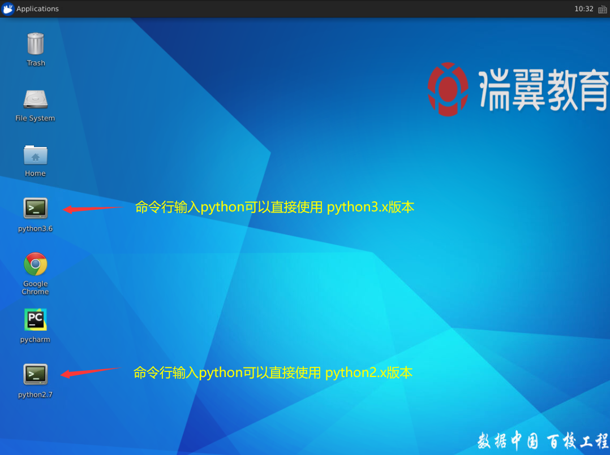
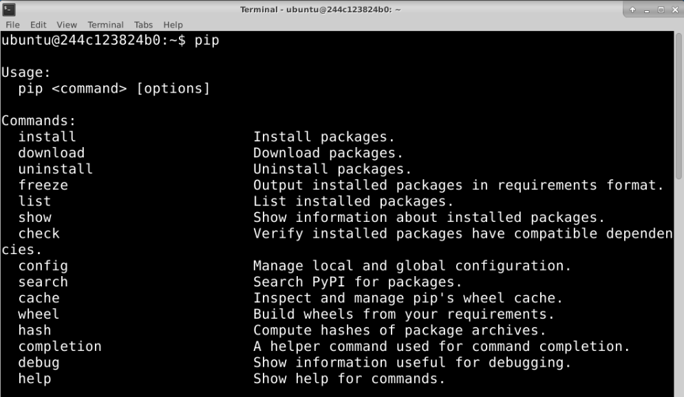
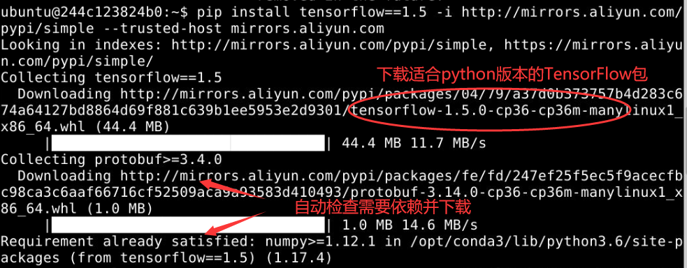
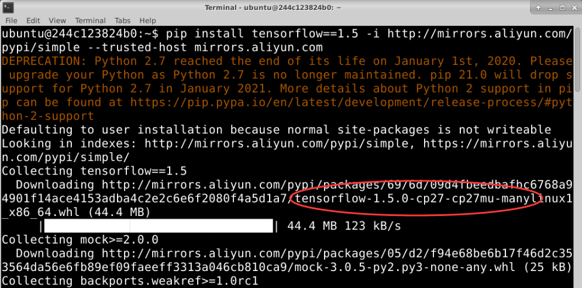
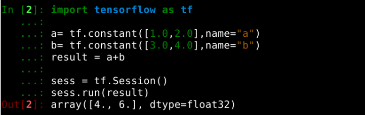

### **实验名称**

实验1 TensorFlow的安装

### **实验目的**

1.了解TensorFlow

2.掌握python安装TensorFlow的方法

### **实验背景**

TensorFlow™是一个基于数据流编程（dataflow programming）的符号数学系统，被广泛应用于各类机器学习（machine learning）算法的编程实现，其前身是谷歌的神经网络算法库DistBelief。

Tensorflow拥有多层级结构，可部署于各类服务器、PC终端和网页并支持GPU和TPU高性能数值计算，被广泛应用于谷歌内部的产品开发和各领域的科学研究。Tensorflow目前是应用最广泛的深度学习框架之一。

### **实验原理**

TensorFlow提供Python语言下的四个不同版本：CPU版本（tensorflow）、包含GPU加速的版本（tensorflow-gpu），以及它们的每日编译版本（tf-nightly、tf-nightly-gpu）。直接用python安装TensorFlow是最简单的方式。

pip 是一个安装Python 软件包并对其进行管理的工具（[https://pip.pypa.io](https://pip.pypa.io) 页面为 pip 的相关说明文档），使用pip可以安装按官方标准打包好的 TensorFlow 及其所需要的依赖关系。如果用户所使用的系统环境较为特殊，比如想要定制化的 TensorFlow 时或者用户的gcc版本较新时，不推荐采用这种方式进行安装。

### **实验环境**

Ubuntu 16.04

Python 3.6/2.7

pip 20.2.2

### **建议课时**

1课时

### **实验步骤**

#### 1\. 确认环境

打开终端，若机器中包含多个版本的python，需要确定pip是为哪个版本python进行软件包管理。可以通过打开不同终端使用python3.x和python2.7。



下面以python3.x为例，命令行输入`pip`得到其使用方法，



#### 2\. 安装TensorFlow

实验安装的版本为1.5，在pip命令后加入`-i http://mirrors.aliyun.com/pypi/simple --trusted-host mirrors.aliyun.com` 使用国内阿里源可以获得更快的下载速度。python3.x和python2.x安装是一样的命令：

```markup
pip install tensorflow==1.5 -i http://mirrors.aliyun.com/pypi/simple --trusted-host mirrors.aliyun.com
```

以python3.6为例，效果如下，可以看到pip会下载符合python版本的whl包至本地进行安装。



而python2.7安装时候对应的TensorFlow包则不一样（不建议在实践中使用python2.7学习深度学习）：



#### 3\. 确认安装成功

安装完成后，确认TensorFlow可以在python中使用，以python3.6为例。首先在终端键入`ipython`，后测试一个用TensorFlow进行向量计算的python源码：

```python
import tensorflow as tf

a= tf.constant([1.0,2.0],name="a")
b= tf.constant([3.0,4.0],name="b")
result = a+b

sess = tf.Session()
sess.run(result)
```

会话运行后会有以下结果产生：

array(\[ 4., 6.\],dtype=float32) 

将上述的整个流程（首次执行可能会出现一些警告，不影响）：



### **实验总结**

本实验介绍了python安装TensorFlow 1.5的方法，用pip命令指定国内源进行安装。