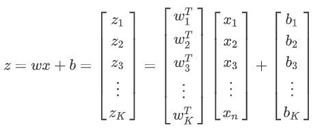

### **实验名称**

实验4 常用的Softmax与损失函数实验

### **实验目的**

通过实验掌握Softmax算法以及交叉熵、one-hot和Sparse交叉熵的损失函数原理及实现

### **实验背景**

Softmax是机器学习中一个非常重要的工具，可谓是分类任务的标配。既可以独立作为机器学习的模型进行建模训练、又可以作为深度学习的激活函数。它是logistic回归模型（即Sigmoid激活函数）在多分类问题上的推广，适用于多分类问题，且类别之间互斥的，即只属于其中的一个类的场合。其作用简单的说就是计算一组数值中每个值的占比。

对应数学公式如下：

$$

P(S_i)=\frac{e^{logits_i}}{\sum_{k=1}^{K}(e^{logits_k})}

$$

公式场景描述：设一共有​K个用数值表示的目标分类，P(Si)​为样本数据属于第i​类的概率，k$\in$\[1,K\]​，K​表示分类个数。​logitsi表示本层输入数据中对应该分类的分量值。

​​logits：这里表示的是神经网络的一层输出结果。一般是全连接层的输出，softmax的输入，该输出一般会再接一个softmax得到归一化后的概率，用于多分类。logist​和统计中定义的logits=log(p/(1-p))​没什么关系，深度学习中的数据在输入激活函数之前都可以叫做logits。

Softmax通常应用在多分类问题的输出层，它可以保证所有输出神经元之和为1，而每个输出对应的​区间的数值就是该输出的概率，在应用时取概率最大的输出作为最终的预测。

### **实验原理**

#### Softmax原理

关于Softmax原理，我们先来看一个简单的Softmax网络模型：

​

Softmax网络模型​

其中：​

这个模型表达的是：输入形如X1、X2​、...、X3的样本数据，准备生成S1、S2、...、SK​的​K个类。那么根据Softmax算法思想对于第​i个样本（X1i,X2i,...,Xni）属于S1​类的概率，可以转化成​$P(S_1)=\frac{e^{z_1}}{\sum_{k=1}^{K}(e^{z_k})}=\frac{e^{w_1^T.x_i+b_1}}{\sum_{k=1}^{K}(e^{z_k})}$，同理可得到样本属于其他类别的概率P(S2)、P(S3)、...、P（SK）​，比较得出其中最大的概率值对应的类别，即为经过Softmax算法处理后，得到的该样本所属类别。

例如：某神经网络模型的上一层输出结果logits=\[9,6,3,1\]​​​，经过Softmax转换后为logits\_Softmax=\[0.950027342724    0.0472990762635    0.00235488234367    0.000318698668969\]​​。显然，Softmax函数将上层输出logits映射到区间\[0,1\]，而且做了归一化处理，结果的所有元素和为1。可以直接当作概率对待，选取概率最大的分类（第一类）作为预测的目标。

可以看出，Softmax函数使用了指数，这样可以让大的值更大，小的值则更小，增加了区分对比度，学习效率更高。而且softmax是连续可导的，消除了拐点，这个特性在机器学习的梯度下降法等地方非常必要。回忆第五章的MNIST手写数字图片分类案例，目标是把每一张图片都表示成一个数字0-9。这里就需要计算出每个图片属于每个数字的概率，取最大概率的对应数值，便是该图片的分类。这就是一个Softmax回归模型的典型案例。

注意：实际使用中，Softmax的分类标签均为one-hot编码。而且用Softmax计算时，要将目标分为几类，最后一层就要有几个节点（即神经元）。

#### 损失函数定义

谈及损失函数，大家并不陌生。常见的词汇如：误差，偏差，Error，Cost，Loss，损失，代价等。在本节中，使用“损失函数”和“Loss Function”这两个词汇，具体的损失函数符号用J​来表示，误差值用​loss表示。

“损失”是指所有样本的“误差”总和，即：

J=$\sum_{i=1}^{n}loss_i$

其中n为样本数，​表示第​个样本的误差，​表示所有样本的误差的总和即整体样本的损失函数值。

在神经网络训练过程中，损失函数的作用就是计算神经网络每次迭代的正向传播计算结果与真实值的差距，来判断网络是否已经训练到了可接受的状态。从而指导下一步的训练向正确的方向进行。

损失函数可以分为分类和回归两种主要类型，下面我们分别介绍一种比较常见的损失函数：均值平方差（MSE）和交叉熵。

#### 常用的损失函数

##### 1、均值平方差

均值平方差（Mean Squared Error，MSE），也称“均方误差”，常用于回归预测问题的模型评估。度量的是预测值和实际观测值间差的平方的均值。它只考虑误差的大小，不考虑其方向。而且由于经过平方，与真实值偏离较多的预测值会受到更为严重的惩罚。对应公式如下：

MSE=$\frac{1}{n}\sum_{i=1}^{n}(observde_i-predicted_i)^2$

MSE的值越小，表明模型拟合的越好。类似的损失函数还有：

平均绝对偏差​$MAD=\frac{1}{n}\sum_{i=1}^{n}|observde_i-predicted_i|$

均方根误差​$RMSE=\sqrt{MSE}\quad$等。

需要注意的是，在回归预测问题中计算损失函数值时，预测值与真实值要控制在同样的数据分布内。如经过Sigmoid激活函数处理后的值在（0,1）​之间，那么真实的观测值也需要归一化到0~1之间，否则损失函数值将失去意义。

##### 2、交叉熵

交叉熵（Cross Entropy），是Shannon信息论中一个重要概念，主要用于度量两个概率分布间的差异性信息。在神经网络中作为损失函数，一般用在分类问题中，表示预测输入样本属于某一类的概率。随着预测概率偏离实际标签，交叉熵会逐渐增加。交叉熵也是值越小，表明模型拟合的越好。

对于二分类问题，模型最后需要预测的结果只有两种情况，对于每个类别我们的预测得到的概率为​和​。此时交叉熵计算公式如下：

$$

c=-\frac{1}{n}\sum_x[ylnp+(1-y)ln(1-p)]

$$

其中：

​n：为记录数， 表示对训练样本的误差汇总再取平均。

y​：表示样本的label，正类为1，负类为0。

p​：表示样本预测为1的概率，是通过分布统一化处理或是经过Sigmoid函数激活的，处于​(0,1)区间。

多分类问题，其实就是对二分类问题的拓展，交叉熵计算公式如下：

$$

c=-\sum_{i=1}^{K}y_iln(p_i)

$$

其中：

K​：目标类别的数量。

​yi ：指示变量（0或1），如果预测的结果和真实类别相同就是1，否则为0。

​ pi：根据正向传播计算的样本属于类别​的预测概率。

实际应用中，损失函数还有很多，这里不再一一介绍。通过前面的介绍，可以看出，均方误差MSE一般用于回归问题，交叉熵一般用于分类问题。另外，损失函数的选取还和输入标签数据的类型有关，如果输入数据为实数、无界的值，损失函数一般用平方差；如果输入标签是位矢量（分类标志），使用交叉熵效果会更好。

#### TensorFlow中常见的损失函数

##### 1、均值平方差​

TensorFlow中没有单独的均值平方差MSE的函数，常见的几种代码实现如下：

​​​MSE=tf.reduce\_mean(tf.pow(tf.sub(logits,outputs),2.0))

##### MSE=tf.reduce\_mean(tf.square(tf.sub(logits,outputs)))

​​​​MSE=tf.reduce\_mean(tf.square(logits-outputs))

此处的logits代表观测数据的真实标签值，outputs代表预测值。

另外，平均绝对偏差：

​MAD=tf.reduce\_mean(tf.complex\_abs(tf.sub(logits,outputs)))

均方根误差:

RMSE=$\sqrt[2]{MSE}$\=tf.sqrt(tf.reduce\_mean(tf.pow(tf.sub(logits,outputs),2.0)))

##### 2、交叉熵

TensorFlow中常见交叉熵函数包括：

1.  Sigmoid交叉熵：
    
    ```markup
     tf.nn.sigmoid_cross_entropy_with_logits(labels=None,logits=None,name=None)
    ```
    
    计算输入logits和targets的交叉熵，要求logits和labels必须为相同的shape和数据类型。其中：
    
    logits：神经网络中的​计算的输出，是神经网络的一次正向传播输出的不带非线性函数的结果。logits的数据类型type为float32或float64，shape为\[batch\_size,num\_classes\]，单个样本的情况下，shape为\[num\_classes\]。
    
    labels：和logits具有相同的数据类型type(float)和shape的张量(tensor)，即数据类型和张量维度都一致。
    
    ​name：操作的名字
    
    输出：是一个batch中每个样本的loss,所以一般配合tf.reduce\_mean(loss)使用，输出的shape为\[batch\_size,num\_classes\]。
    
    注意：Sigmoid交叉熵对于输入的logits先通过sigmoid函数计算，再计算交叉熵，但是它对交叉熵的计算方式进行了优化，使得结果不至于溢出。输出不是一个数，而是一个batch中每个样本的loss。
    
2.  Softmax交叉熵：
    
    ```markup
     tf.nn.softmax_cross_entropy_with_logits(labels=None,logits=None, name=None)
    ```
    
    计算logits和labels的Softmax交叉熵，要求logits和labels必须为相同的shape和数据类型。其中logits、name参数和Sigmoid交叉熵一样，不同的是：
    
    labels：和logits具有相同type和shape的张量(tensor)，sum(labels)=1，一般要求lebels是独热编码形式下效果更好(及labels中只有一个值为1.0，其他值为0.0)。
    
    输出：输出的shape为\[batch\_size\]。
    
    ```markup
     注意：
     Softmax交叉熵具体的执行流程大概分为两步：
     第一步：先对网络最后一层的输出logits做一个softmax，这一步通常是求取输出属于某一类的概率，对于单样本而言，输出就是一个num_classes大小的向量（[Y1，Y2,Y3...]其中Y1，Y2，Y3...分别代表了是属于该类的概率）
     第二步：对softmax的输出向量[Y1，Y2,Y3...]和样本的实际标签做一个交叉熵
     续：如果要获得损失值，还需对第二步的结果向量中的元素累加求均值。
    ```
    
3.  Sparse交叉熵
    
    ```markup
     tf.nn.sparse_softmax_cross_entropy_with_logits(labels=None,logits=None, name=None)
    ```
    
    计算logits和labels的Sparse交叉熵，要求两者必须为相同的shape和数据类型。与Softmax交叉熵不同的是Sparse交叉熵的样本真实值与预测结果不需要one-hot编码。其中：
    
    labels：shape为\[batch\_size\]，labels\[i\]是{0,1,2,......,num\_classes-1}的一个索引，type为int32或int64。简言之就是，使用Sparse交叉熵TensorFlow会自动将原来的类别索引转换成one\_hot形式，然后与labels表示的one\_hot向量比较，计算交叉熵。
    
    输出：shape为\[batch\_size\]。
    
4.  加权Sigmoid交叉熵
    
     tf.nn.weighted\_cross\_entropy\_with\_logits(labels,logits, pos\_weight, name\=None)
    
    计算具有权重的sigmoid交叉熵，以增加或减少正样本在计算交叉熵时的损失值。
    
    特别地：
    
    pos\_weight：正样本的一个系数。
    
    输出：输出损失的shape为\[batch\_size,num\_classes\]。
    

当然在真实的应用场景，除了可以直接调用TensorFlow中实现的损失函数，也可以像实现MSE那样自主组公式计算交叉熵。

### **实验环境**

Ubuntu 16.04

Python 3.6

tensorflow 1.14.0

### **建议课时**

1个课时

### **实验步骤**

#### 一、前期准备

1、启动Pycharm，建立“test”工程目录，如下图所示。


#### 二、定义数据集与损失函数

##### **2.1 交叉熵实验（Cross-Entropy）**

在“test”目录下创建“Cross\_Entropy.py”文件。

现假设有一个标签​和一个网络输出值​，要求编写代码完成下面三个要求：

1.  将logits分别进行1次和2次Softmax，对比结果的区别。
    
2.  将进行1次和2次Softmax处理的logits分别计算交叉熵，对比结果区别。
    
3.  对做2次Softmax的结果进行自行组合公式计算交叉熵。
    

具体代码如下： 

```markup
#导入TensorFlow包
 import tensorflow as tf
 labels=[[0,0,1],[0,1,0]]
 logits=[[2,0.5,6],[0.1,0,3]]
 #要求1：对logits分别进行1次和2次softmax
 logits_softmax1=tf.nn.softmax(logits)
 logits_softmax2=tf.nn.softmax(logits_softmax1)
 #要求2：对logits进行Softmax交叉熵计算，相当于对logits先进行1次Softmax处理后，然后计算交叉熵。
 res1=tf.nn.softmax_cross_entropy_with_logits(labels=labels,logits=logits)
 #要求2：对进行1次Softmax的logits进行Softmax交叉熵计算，相当于对logits进行2次Softmax处理后，然后计算交叉熵。
 res2=tf.nn.softmax_cross_entropy_with_logits(labels=labels,logits=logits_softmax1)
 #要求3：对进行2次Softmax的logits利用自建公式，然后计算交叉熵。
 res3=-tf.reduce_sum(labels*tf.log(logits_softmax1),1)
 with tf.Session() as sess:
     #要求1：打印分别进行1次和2次Softmax后的结果
     print("logits_softmax1=",sess.run(logits_softmax1))
     print("logits_softmax2=",sess.run(logits_softmax2))
     #要求2：打印分别进行1次和2次Softmax后的交叉熵
     print("res1=",sess.run(res1))
     print("res2=",sess.run(res2))
     #要求3：打印进行2次Softmax的logits利用自建公式计算得到的交叉熵，结果等同于计算logits的Softmax交叉熵。
     print("res3=",sess.run(res3))
```

运行程序，输出结果如下：


可以看出：

logits里的值加和都大于1，经过1次Softmax后得到的logits\_softmax1里的每个样本的值加和变为1。而经过2次Softmax得到的logits\_softmax2，每个样本的值加和依然为1，但是分布概率发生了变化，这不是我们想要的结果。

对比res1和res2：计算logits的Softmax交叉熵，是不需要先进行1次Softmax的，直接将logits传入softmax\_cross\_entropy\_with\_logits即可。logits中第一个跟真实标签分类相符，第二个与真实标签分类不符，所以第一个的交叉熵比较小：0.02215516<3.0996735）。如果将进行过1次Softmax得到的logits\_softmax1传入softmax\_cross\_entropy\_with\_logits就相当于进行了2次Softmax然后求交叉熵，分布概率相应变化，自然交叉熵失去作用。

res3=res1，说明自己组建的公式实现了softmax\_cross\_entropy\_with\_logits一样的效果。

##### **2.2 one-hot实验**

以上的交叉熵实验，目标标签是标准的one-hot类型，即类别数组中非0即1，总和为1。以下案例，输入的标签将不是标准的one-hot，采用一组总和也为1，但是数组中每个值都不等于0或1的数组代替标签。

注：one\_hot编码，就是将真实标签转换为0、1标签，需要注意的是tf的one\_hot编码中标签0代表的是1,0,0...而非0,0,0...。

在“test”目录下创建“one\_hot01.py”文件，输入以下代码。 

```markup
#导入需要的包
 import tensorflow as tf
 import numpy as np
 #原始标签
 labels_n=np.array([0,1,2])
 #利用tf.one_hot对标签进行独热编码
 labels_oh=tf.one_hot(labels_n,depth=3)
 #运行Session，打印编码后的结果
 with tf.Session() as sess:
     print(sess.run(labels_oh))
```

运行结果如下：


可以看到，程序对数组\[0,1,2\]进行了独热编码。

再假设有一个标签​（与上面的\[\[0,0,1\],\[0,1,0\]\]目标分类一样）和一个网络输出值​，计算logits的Softmax交叉熵。

在“test”目录下创建“one-hot02.py”文件，输入以下代码。

```markup
 #导入TensorFlow包
 import tensorflow as tf
 labels=[[0.4,0.1,0.5],[0.3,0.6,0.1]]
 logits=[[2,0.5,6],[0.1,0,3]]
 #计算logits的Softmax交叉熵
 res4=tf.nn.softmax_cross_entropy_with_logits(labels=labels,logits=logits)
 with tf.Session() as sess:
     #打印res4
     print("res4=",sess.run(res4))
```

运行结果如下：


对比logits和labels可以看出第一个样本正确分类，第二个样本理论上属于错误分类，而res4中两者结果的交叉熵差别没有上面实验中标准的one-hot实验对应的交叉熵res1= \[0.02215516 3.0996735 \] 明显，因此在对logits求Softmax交叉熵时，labels应为one-hot编码形式。

##### **2.3 Sparse交叉熵实验**

接下来看一下Sparse交叉熵的实现sparse\_softmax\_cross\_entropy\_with\_logits函数的具体使用，它需要使用非one-hot的标签。所以此处将标签换成​，比较其与one-hot标签实验的区别。

在“test”目录下创建“Sparse.py”文件，输入以下代码。

```markup
 #导入TensorFlow包
 import tensorflow as tf
 #表明labels中共分为3个类：0、1、2。其中labels=[2,1]等价于one-hot编码中的[[0,0,1],[0,1,0]]
 labels=[2,1]
 logits=[[2,0.5,6],[0.1,0,3]]
 #计算logits的Softmax交叉熵
 res5=tf.nn.sparse_softmax_cross_entropy_with_logits(labels=labels,logits=logits)
 with tf.Session() as sess:
     #打印res5
     print("res5=",sess.run(res5))
```

运行结果如下：


可以看到res5与前面的res1= \[0.02215516 3.0996735 \] 结果一样。

#### 三、计算loss值

在实际的神经网络中，前面的几个实验仅仅得到批次样本的交叉熵数组，如res1,、res3、res4和res5这样一个数组是不能满足直观评判网络学习质量的要求的，还需要对其求均值，最终变成一个具体数值，即损失值。

接下来，对前面logits的Softmax交叉熵结果res1和logits的Softmax结果logits\_softmax1计算loss值。

在“test”目录下创建“loss.py”文件，输入以下代码。 

```markup
#导入TensorFlow包
 import tensorflow as tf
 labels=[[0,0,1],[0,1,0]]
 logits=[[2,0.5,6],[0.1,0,3]]
 #logits进行1次Softmax转换
 logits_softmax1=tf.nn.softmax(logits)
 #计算logits的Softmax交叉熵得到res1
 res1=tf.nn.softmax_cross_entropy_with_logits(labels=labels,logits=logits)
 #计算res1的loss值
 loss1=tf.reduce_mean(res1)
 #计算logits_softmax1的交叉熵然后计算loss值
 loss2=tf.reduce_mean(-tf.reduce_sum(labels*tf.log(logits_softmax1),1))
 with tf.Session() as sess:
     #打印结果
     print("loss1=",sess.run(loss1))
     print("loss2=",sess.run(loss2))
```

运行结果如下：


对比发现，loss1和loss2的值基本一致。

### **实验总结**

无论通过TensorFlow中实现的函数，还是通过读者自行组合公式，均可实现计算loss值。

学完本小节内容，读者可尝试将第五章手写数字分类实验中计算交叉熵损失函数值部分改用求解Sparse交叉熵并计算loss值。