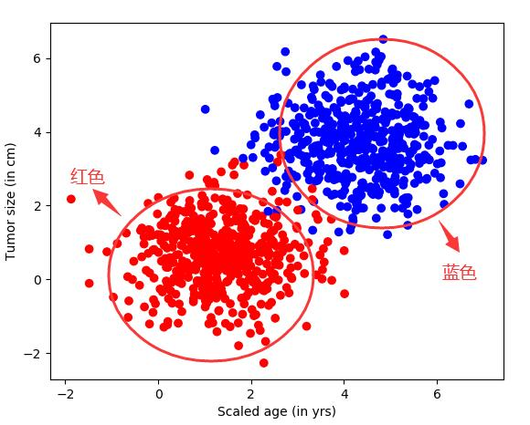
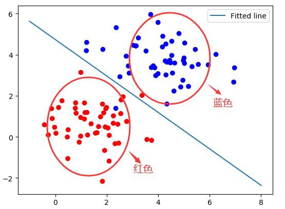
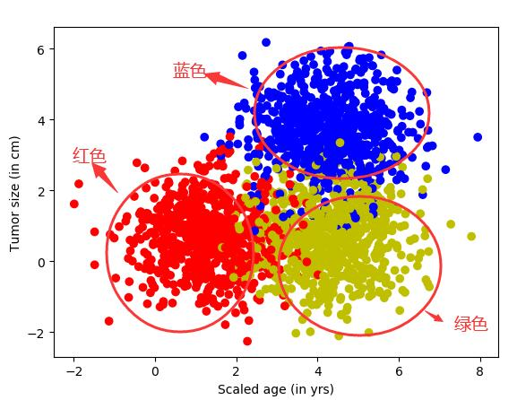
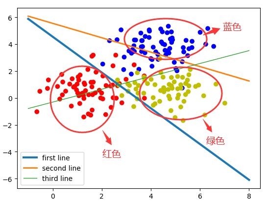
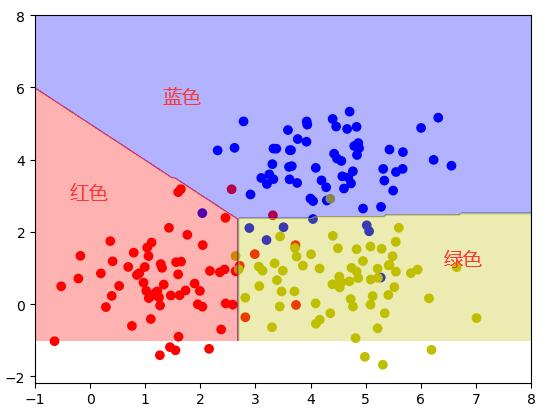

### 实验名称

使用线性逻辑处理分类问题

### 实验目的

1.了解线性问题与非线性问题的区别

2.掌握使用线性逻辑回归处理二分类问题

3.掌握使用线性逻辑回归处理多分类问题

4.了解非线性问题浅析

### 实验背景

“线性问题”与“非线性问题”是神经网络中的常用术语：

“线性问题”：可以用直线分割的方式解决问题，则可以说这个问题是线性可分的。同理，类似这样的数据集就可以被称为线性可分数据集合。凡是使用这种方法来解决的问题就叫做线性问题。

“非线性问题”：非线性问题，就是用直线分不开的问题，可以结合“线性问题”的概念进行理解。

### 实验原理

1．二分类模型：

模型生成的结果可用公式表示为：z= x1w1+x2\*w2+b

如果将x1和x2映射到直角坐标系中的x和y坐标， 那么z就可以被分为小于0和大于0两部分。当z=0时，就代表直线本身，令上面的公式中z等于零，就可以将模型转化成如下直线方程：

​

       x2=-x1\* w1/w2-b/w2，即：y=-x\* （w1/w2）-（b/w2）

​

其中，w1、w2、b都是模型中的学习参数，带到公式中用plot 显示出来。

2．多分类模型

直线的斜率和截距是由神经网络的学习参数转化而来的。在神经网络里，一个样本通过这3个公式会得到3个结果，这3个结果可以理解成3个类的特征值。其中哪个值最大，则表示该样本具有哪种类别的特征最强烈，即属于哪一类。可以在横轴随便找 一个值，分别带到3条直线的公式里，哪条直线得出的y值最大，则说明该点属于哪一类。这3条线也没有把集合点分开，这是因为它们的分类规则是不一样的。由此可得直线公式：

​

        y=-x\* （w1/w2）-（b/w2）

​

一般而言，如果一个点在直线上，等式成立；如果点在直线的上方，那么左边的y值就大；如果点在直线的下方，那么右边的算式值就大。

### 实验环境

ubuntu 16.04

python 3.6

numpy 1.18.3

matplotlib 3.2.0

tensorFlow 1.5.0

### 建议课时

2课时

### 实验步骤

#### 用线性逻辑回归处理二分类问题

案例：假设某医院想使用神经网络对已有的病例数据进行分类，样本数据的特征包括病人的年龄和肿瘤的大小等，最后需要对该病例数据进行标注为是良性肿瘤还是恶性肿瘤。

步骤一： 样本数据生成

引入依赖库

```markup
import tensorflow as tf
import matplotlib.pyplot as plt
import numpy as np
from sklearn.utils import shuffle
```

使用Python函数生成模拟数据，假设样本数据为二位数组，数组中包含：病人年龄，肿瘤大小。generate为生成模拟样本的函数，按照指定的均值和方差生成固定数量的样本，实现代码如下所示：

```markup
# 模拟数据点
def generate(sample_size, mean, cov, diff, regression):
   # 类别数
   num_classes = 2  # len(diff)
   # 个类别采样个数
   samples_per_class = int(sample_size / 2)
​   # 用于根据实际情况生成一个多元正态分布矩阵
   X0 = np.random.multivariate_normal(mean, cov, samples_per_class)
   #  返回来一个给定形状和类型的用0填充的数组
   Y0 = np.zeros(samples_per_class)
​
   for ci, d in enumerate(diff):
       # 用于根据实际情况生成一个多元正态分布矩阵
       X1 = np.random.multivariate_normal(mean + d, cov, samples_per_class)
       Y1 = (ci + 1) * np.ones(samples_per_class)
​       # 完成多个数组的拼接
       X0 = np.concatenate((X0, X1))
       Y0 = np.concatenate((Y0, Y1))
​   #one hot 编码及数据归一化
   if regression == False:  # one-hot 0 into the vector "1 0
       print("ssss")
       class_ind = [Y0 == class_number for class_number in range(num_classes)]
       # 将结构数据转化为ndarray
       Y = np.asarray(np.hstack(class_ind), dtype=np.float32)
   X, Y = shuffle(X0, Y0)
​
   return X, Y
```

调用generate函数生成1000个模拟数据，并绘制出图形，实现代码如下所示(详细代码实现可参照"用线性逻辑回归处理二分类问题.py")：

```markup
input_dim = 2
np.random.seed(10)  #定义随机数的种子值（保证每次生成的随机值都一样）
num_classes =2  #定义生成类的个数num_classes=2
mean = np.random.randn(num_classes)
cov = np.eye(num_classes)
X, Y = generate(1000, mean, cov, [3.0],True) #表明两类数据的x和y差距3.0
colors = ['r' if l == 0 else 'b' for l in Y[:]]
#散点图
plt.scatter(X[:,0], X[:,1], c=colors)
#x坐标
plt.xlabel("Scaled age (in yrs)")
#y坐标
plt.ylabel("Tumor size (in cm)")
plt.show()
lab_dim = 1
```

运行结果如下图所示：



图7-1 模拟数据-二分类

步骤二：网络构建

结合前面学习的单个神经元的内容，编写代码实现网络结构的构建。首先定义输入、输出两个占位符，其次是w和b的权重，激活函数使用的是Sigmoid，优化器使用AdamOptimizer，实现代码如下所示：

```markup
# 占位符
input_features = tf.placeholder(tf.float32, [None, input_dim])
input_lables = tf.placeholder(tf.float32, [None, lab_dim])
# 定义学习参数
W = tf.Variable(tf.random_normal([input_dim,lab_dim]), name="weight")
b = tf.Variable(tf.zeros([lab_dim]), name="bias")
​# 可以将输出压缩至0～1的范围
output =tf.nn.sigmoid( tf.matmul(input_features, W) + b)
cross_entropy = -(input_lables * tf.log(output) + (1 - input_lables) * tf.log(1 - output))
ser= tf.square(input_lables - output)
#添加加平方差函数cross_entropy，用来评估模型的错误率
loss = tf.reduce_mean(cross_entropy)
err = tf.reduce_mean(ser)
optimizer = tf.train.AdamOptimizer(0.04)
#尽量用这个，因其收敛快，会动态调节梯度
train = optimizer.minimize(loss)
```

步骤三：模型训练

使用上面生成的数据集对构建好的数据模型进行训练，对整个数据集迭代50次，参数设置minibatchsize=25，实现代码如下所示：

```markup
maxEpochs = 50
minibatchSize = 25

#启动session
with tf.Session() as sess:
    sess.run(tf.global_variables_initializer())

#向模型输入数据
    for epoch in range(maxEpochs):
        sumerr=0
        for i in range(np.int32(len(Y)/minibatchSize)):
            x1 = X[i*minibatchSize:(i+1)*minibatchSize,:]
#修改矩阵的形状
            y1 = np.reshape(Y[i*minibatchSize:(i+1)*minibatchSize],[-1,1])
            tf.reshape(y1,[-1,1])
#train，loss的输出
            _,lossval, outputval,errval = sess.run([train,loss,output,err], feed_dict={input_features: x1, input_lables:y1})
            sumerr = sumerr+errval
#输出epoch
        print ("Epoch:", '%04d' % (epoch+1), "cost=","{:.9f}".format(lossval), "err=",sumerr/minibatchSize)
```

代码每次运行后，会将err错误值累加起来，数据集迭代完一次，就将err的错误率进行一次平均，平均值再输出来。经过50次的迭代，得到错误率为0.019的模型，运行结果如下所示：

Epoch: 0001 cost= 0.266018808 err= 0.21159284174442292  
Epoch: 0002 cost= 0.173929259 err= 0.10494360744953156  
Epoch: 0003 cost= 0.129691720 err= 0.06747913986444473  
Epoch: 0004 cost= 0.104512110 err= 0.05049784766510129  
Epoch: 0005 cost= 0.088621341 err= 0.041524481754750014  
Epoch: 0006 cost= 0.077926897 err= 0.036138395126909015  
Epoch: 0007 cost= 0.070351660 err= 0.032607282102108004  
Epoch: 0008 cost= 0.064732544 err= 0.030140046766027807  
Epoch: 0009 cost= 0.060381103 err= 0.028330770460888742  
Epoch: 0010 cost= 0.056878738 err= 0.026952816653065384  
Epoch: 0011 cost= 0.053966250 err= 0.025871280916035175  
Epoch: 0012 cost= 0.051480595 err= 0.025001573632471262  
Epoch: 0013 cost= 0.049316350 err= 0.0242882962198928  
Epoch: 0014 cost= 0.047402948 err= 0.02369371257023886  
Epoch: 0015 cost= 0.045691315 err= 0.023191283587366343  
Epoch: 0016 cost= 0.044145804 err= 0.022761767010670154  
Epoch: 0017 cost= 0.042739879 err= 0.022390904622152447  
Epoch: 0018 cost= 0.041453037 err= 0.022067888495512306  
Epoch: 0019 cost= 0.040268965 err= 0.02178439108422026  
Epoch: 0020 cost= 0.039174534 err= 0.021533880960196258  
Epoch: 0021 cost= 0.038159125 err= 0.021311178148025647  
Epoch: 0022 cost= 0.037213687 err= 0.0211121113342233  
Epoch: 0023 cost= 0.036330689 err= 0.020933291020337492  
Epoch: 0024 cost= 0.035503697 err= 0.02077194250538014  
Epoch: 0025 cost= 0.034727316 err= 0.020625763167627157  
Epoch: 0026 cost= 0.033996619 err= 0.02049282782303635  
Epoch: 0027 cost= 0.033307634 err= 0.020371515705483033  
Epoch: 0028 cost= 0.032656547 err= 0.02026045430859085  
Epoch: 0029 cost= 0.032040313 err= 0.020158486139262095  
Epoch: 0030 cost= 0.031455997 err= 0.020064600359182803  
Epoch: 0031 cost= 0.030901063 err= 0.019977941157994793  
Epoch: 0032 cost= 0.030373378 err= 0.019897761687752792  
Epoch: 0033 cost= 0.029870803 err= 0.01982340065471362  
Epoch: 0034 cost= 0.029391641 err= 0.019754298550542445  
Epoch: 0035 cost= 0.028934238 err= 0.019689966383448335  
Epoch: 0036 cost= 0.028496943 err= 0.019629936708661262  
Epoch: 0037 cost= 0.028078625 err= 0.019573843039979694  
Epoch: 0038 cost= 0.027678028 err= 0.019521335803437977  
Epoch: 0039 cost= 0.027293978 err= 0.019472103520820384  
Epoch: 0040 cost= 0.026925402 err= 0.01942587512807222  
Epoch: 0041 cost= 0.026571566 err= 0.019382399583118968  
Epoch: 0042 cost= 0.026231322 err= 0.019341467930644285  
Epoch: 0043 cost= 0.025904205 err= 0.019302872693224345  
Epoch: 0044 cost= 0.025589263 err= 0.01926643870770931  
Epoch: 0045 cost= 0.025285890 err= 0.019231995360169094  
Epoch: 0046 cost= 0.024993485 err= 0.01919940965803107  
Epoch: 0047 cost= 0.024711397 err= 0.019168537343939532  
Epoch: 0048 cost= 0.024439188 err= 0.019139263620745625  
Epoch: 0049 cost= 0.024176311 err= 0.019111471443611663  
Epoch: 0050 cost= 0.023922233 err= 0.019085063068632734

步骤四：可视化

为了直观地展示处理结果，现将模型结果和样本进行可视化显示出来，先取100个测试点，在图像上显示出来，且将模型以一条直线的方式显示出来，实现代码如下所示：

```markup
 #生成训练数据
 train_X, train_Y = generate(100, mean, cov, [3.0], True)
 colors = ['r' if l == 0 else 'b' for l in train_Y[:]]
 #散点图
 plt.scatter(train_X[:, 0], train_X[:, 1], c=colors)
 # 生成指定区间指定元素个数的列表,
 x = np.linspace(-1, 8, 200)
 y = -x * (sess.run(W)[0] / sess.run(W)[1]) - sess.run(b) / sess.run(W)[1]
 #绘制
 plt.plot(x, y, label='Fitted line')
 #图例
 plt.legend()
 #显示图片
 plt.show()
```

运行结果如下图所示：



图7-2 线性逻辑回归

详细代码实现可参照"用线性逻辑回归处理二分类问题.py“

```markup
# -*- coding: utf-8 -*-
import tensorflow as tf
import matplotlib.pyplot as plt
import numpy as np
from sklearn.utils import shuffle

# 模拟数据点
def generate(sample_size, mean, cov, diff, regression):
    num_classes = 2  # len(diff)
    samples_per_class = int(sample_size / 2)

    X0 = np.random.multivariate_normal(mean, cov, samples_per_class)
    Y0 = np.zeros(samples_per_class)

    for ci, d in enumerate(diff):
        X1 = np.random.multivariate_normal(mean + d, cov, samples_per_class)
        Y1 = (ci + 1) * np.ones(samples_per_class)

        X0 = np.concatenate((X0, X1))
        Y0 = np.concatenate((Y0, Y1))

    if regression == False:  # one-hot  0 into the vector "1 0
        print("ssss")
        class_ind = [Y0 == class_number for class_number in range(num_classes)]
        Y = np.asarray(np.hstack(class_ind), dtype=np.float32)
    X, Y = shuffle(X0, Y0)

    return X, Y


input_dim = 2
np.random.seed(10)
num_classes = 2
mean = np.random.randn(num_classes)
cov = np.eye(num_classes)
X, Y = generate(1000, mean, cov, [3.0], True)
colors = ['r' if l == 0 else 'b' for l in Y[:]]
plt.scatter(X[:, 0], X[:, 1], c=colors)
plt.xlabel("Scaled age (in yrs)")
plt.ylabel("Tumor size (in cm)")
plt.show()
lab_dim = 1
# tf Graph Input
input_features = tf.placeholder(tf.float32, [None, input_dim])
input_lables = tf.placeholder(tf.float32, [None, lab_dim])
# Set model weights
W = tf.Variable(tf.random_normal([input_dim, lab_dim]), name="weight")
b = tf.Variable(tf.zeros([lab_dim]), name="bias")

output = tf.nn.sigmoid(tf.matmul(input_features, W) + b)
cross_entropy = -(input_lables * tf.log(output) + (1 - input_lables) * tf.log(1 - output))
ser = tf.square(input_lables - output)
loss = tf.reduce_mean(cross_entropy)
err = tf.reduce_mean(ser)
optimizer = tf.train.AdamOptimizer(0.04)  # 尽量用这个--收敛快，会动态调节梯度
train = optimizer.minimize(loss)  # let the optimizer train

maxEpochs = 50
minibatchSize = 25

# Launch the graph
with tf.Session() as sess:
    sess.run(tf.global_variables_initializer())

    for epoch in range(maxEpochs):
        sumerr = 0
        for i in range(np.int32(len(Y) / minibatchSize)):
            x1 = X[i * minibatchSize:(i + 1) * minibatchSize, :]
            y1 = np.reshape(Y[i * minibatchSize:(i + 1) * minibatchSize], [-1, 1])
            tf.reshape(y1, [-1, 1])
            _, lossval, outputval, errval = sess.run([train, loss, output, err],
                                                     feed_dict={input_features: x1, input_lables: y1})
            sumerr = sumerr + errval

        print("Epoch:", '%04d' % (epoch + 1), "cost=", "{:.9f}".format(lossval), "err=", sumerr / minibatchSize)

    # Graphic display
    train_X, train_Y = generate(100, mean, cov, [3.0], True)
    colors = ['r' if l == 0 else 'b' for l in train_Y[:]]
    plt.scatter(train_X[:, 0], train_X[:, 1], c=colors)
    x = np.linspace(-1, 8, 200)
    y = -x * (sess.run(W)[0] / sess.run(W)[1]) - sess.run(b) / sess.run(W)[1]
    plt.plot(x, y, label='Fitted line')
    plt.legend()
    plt.show()
```

#### 用线性逻辑回归处理多分类问题

案例：在实现过程中先生成3类样本模拟数据，再构造神经网络，最后通过 softmax分类的方法计算神经网络的输出值，并将其进行分开。

步骤一：样本数据生成

引入依赖库

```markup
import tensorflow as tf
import numpy as np
import matplotlib.pyplot as plt

from sklearn.utils import shuffle
from matplotlib.colors import colorConverter, ListedColormap
# 对于上面的fit可以这么扩展变成动态的
from sklearn.preprocessing import OneHotEncoder
```

调用线性逻辑回归处理二分类问题中的generate函数生成生成 2000个模拟数据点、这2000个数据点分成3类，实现代码如下所示：

```markup
# 取随机数
np.random.seed(10)
​# 向量维度
input_dim = 2
#类别数
num_classes =3
X, Y = generate(2000,num_classes, [[3.0],[3.0,0]],False)
aa = [np.argmax(l) for l in Y]
colors =['r' if l == 0 else 'b' if l==1 else 'y' for l in aa[:]]
#将具体的点依照不同的颜色显示出来
plt.scatter(X[:,0], X[:,1], c=colors)
# x轴显示scaled age
plt.xlabel("Scaled age (in yrs)")
# y轴显示tumor size
plt.ylabel("Tumor size (in cm)")
plt.show()
```

运行结果如下图所示：



图7-3 模拟数据-多分类

上图中，红色点作为原始点，在红色点的基础上将 x+3.0后变化成绿色点，而在红色点基础上将x、y各加 3.0变化成蓝色点。

步骤二：网络构建

构建网络模型时，使用softmax分类，损失函数 loss仍然使用交叉熵，优化器选用AdamOptimizer，取one\_hot结果里面不相同的个数进行错误率评估部分，实现代码如下所示：

```markup
lab_dim = num_classes
# 定义占位符
input_features = tf.placeholder(tf.float32, [None, input_dim])
input_lables = tf.placeholder(tf.float32, [None, lab_dim])
# 定义学习参数
W = tf.Variable(tf.random_normal([input_dim,lab_dim]), name="weight")
b = tf.Variable(tf.zeros([lab_dim]), name="bias")
output = tf.matmul(input_features, W) + b
​
z = tf.nn.softmax( output )
​
a1 = tf.argmax(tf.nn.softmax( output ), axis=1) #按行找出最大索引，生成数组
b1 = tf.argmax(input_lables, axis=1)
err = tf.count_nonzero(a1-b1) #两个数组相减，不为0的就是错误个数
​
cross_entropy tf.nn.softmax_cross_entropy_with_logits( labels=input_lables,logits=output)
loss = tf.reduce_mean(cross_entropy) #对交叉熵取均值很有必要
​
optimizer = tf.train.AdamOptimizer(0.04) #尽量用Adam算法的优化器函数，因其收敛快，会动态调节梯度
train = optimizer.minimize(loss)
```

步骤三：模型训练

对数据集进行训练，对整个数据集仍然是迭代50次，参数设置minibatchsize=25，实现代码如下所示：

```markup
maxEpochs = 50
minibatchSize = 25
​
# 启动session
with tf.Session() as sess:
# 初始化模型的参数
sess.run(tf.global_variables_initializer())
​
for epoch in range(maxEpochs):
sumerr=0
for i in range(np.int32(len(Y)/minibatchSize)):
x1 = X[i*minibatchSize:(i+1)*minibatchSize,:]
y1 = Y[i*minibatchSize:(i+1)*minibatchSize,:]
​# train,loss的输出
_,lossval, outputval,errval = sess.run([train,loss,output,err], feed_dict={input_features: x1, input_lables:y1})
sumerr =sumerr+(errval/minibatchSize)
​#输出epoch
print ("Epoch:", '%04d' % (epoch+1), "cost=","{:.9f}".format(lossval),"err=",sumerr/minibatchSize)
```

在迭代训练时对错误率的收集与二分类的代码逻辑一致，运行结果如下所示：

Epoch: 0001 cost= 0.543840170 err= 1.2367999999999997  
Epoch: 0002 cost= 0.383693516 err= 0.4128  
Epoch: 0003 cost= 0.347551078 err= 0.3328000000000002  
Epoch: 0004 cost= 0.338123083 err= 0.32320000000000015  
Epoch: 0005 cost= 0.337716758 err= 0.3120000000000002  
Epoch: 0006 cost= 0.340953380 err= 0.3056000000000002  
Epoch: 0007 cost= 0.345715791 err= 0.3072000000000002  
Epoch: 0008 cost= 0.351045221 err= 0.2992000000000002  
Epoch: 0009 cost= 0.356474280 err= 0.2960000000000002  
Epoch: 0010 cost= 0.361768156 err= 0.2944000000000002  
Epoch: 0011 cost= 0.366810083 err= 0.2944000000000002  
Epoch: 0012 cost= 0.371546656 err= 0.29280000000000017  
Epoch: 0013 cost= 0.375958800 err= 0.2832000000000002  
Epoch: 0014 cost= 0.380046457 err= 0.2816000000000002  
Epoch: 0015 cost= 0.383819997 err= 0.2816000000000002  
Epoch: 0016 cost= 0.387295008 err= 0.2800000000000002  
Epoch: 0017 cost= 0.390489846 err= 0.2800000000000002  
Epoch: 0018 cost= 0.393423647 err= 0.27680000000000016  
Epoch: 0019 cost= 0.396115452 err= 0.27680000000000016  
Epoch: 0020 cost= 0.398583829 err= 0.2784000000000002  
Epoch: 0021 cost= 0.400846243 err= 0.2784000000000002  
Epoch: 0022 cost= 0.402919322 err= 0.2784000000000002  
Epoch: 0023 cost= 0.404818445 err= 0.2784000000000002  
Epoch: 0024 cost= 0.406557620 err= 0.27680000000000016  
Epoch: 0025 cost= 0.408150285 err= 0.27680000000000016  
Epoch: 0026 cost= 0.409608573 err= 0.27520000000000017  
Epoch: 0027 cost= 0.410943627 err= 0.27520000000000017  
Epoch: 0028 cost= 0.412165791 err= 0.27520000000000017  
Epoch: 0029 cost= 0.413284540 err= 0.27520000000000017  
Epoch: 0030 cost= 0.414308518 err= 0.27520000000000017  
Epoch: 0031 cost= 0.415245622 err= 0.27680000000000016  
Epoch: 0032 cost= 0.416103393 err= 0.27680000000000016  
Epoch: 0033 cost= 0.416888386 err= 0.27680000000000016  
Epoch: 0034 cost= 0.417606533 err= 0.27680000000000016  
Epoch: 0035 cost= 0.418264002 err= 0.2784000000000002  
Epoch: 0036 cost= 0.418865383 err= 0.27680000000000016  
Epoch: 0037 cost= 0.419415712 err= 0.27680000000000016  
Epoch: 0038 cost= 0.419919193 err= 0.27680000000000016  
Epoch: 0039 cost= 0.420379877 err= 0.27680000000000016  
Epoch: 0040 cost= 0.420801282 err= 0.2784000000000002  
Epoch: 0041 cost= 0.421186894 err= 0.2784000000000002  
Epoch: 0042 cost= 0.421539664 err= 0.2784000000000002  
Epoch: 0043 cost= 0.421862245 err= 0.2784000000000002  
Epoch: 0044 cost= 0.422157377 err= 0.2784000000000002  
Epoch: 0045 cost= 0.422427475 err= 0.2784000000000002  
Epoch: 0046 cost= 0.422674596 err= 0.2784000000000002  
Epoch: 0047 cost= 0.422900468 err= 0.2784000000000002  
Epoch: 0048 cost= 0.423107058 err= 0.2784000000000002  
Epoch: 0049 cost= 0.423296094 err= 0.2784000000000002  
Epoch: 0050 cost= 0.423469007 err= 0.2784000000000002

步骤四：可视化

接下来是对于三分类问题使用线性可分原理进行拆分。先取 200个测试点，显示在图像上，并将模型中x1、x2的映射关系以一条直线的方式显示出来。由于有3个输出端节点，因此，会产生3条直线，实现代码如下所示：

```markup
# 生成训练数据
train_X, train_Y = generate(200,num_classes, [[3.0],[3.0,0]],False)
aa = [np.argmax(l) for l in train_Y]
colors =['r' if l == 0 else 'b' if l==1 else 'y' for l in aa[:]]
#散点图
plt.scatter(train_X[:,0], train_X[:,1], c=colors)
​# 生成区间内指定元素个数的列表
x = np.linspace(-1,8,200)
​
y=-x*(sess.run(W)[0][0]/sess.run(W)[1][0])-sess.run(b)[0]/sess.run(W)[1][0]
plt.plot(x,y, label='first line',lw=3)
​
y=-x*(sess.run(W)[0][1]/sess.run(W)[1][1])-sess.run(b)[1]/sess.run(W)[1][1]
plt.plot(x,y, label='second line',lw=2)
​
y=-x*(sess.run(W)[0][2]/sess.run(W)[1][2])-sess.run(b)[2]/sess.run(W)[1][2]
plt.plot(x,y, label='third line',lw=1)
​# 图例
plt.legend()
# 显示图形
plt.show()
# 得到最佳拟合结果 
print(sess.run(W),sess.run(b))
```

运行结果如下所示：

\[\[-1.7732856  1.2260613  1.327865 \]  
 \[-1.5883274  1.4635632 -1.5795594\]\] \[ 7.2447453 -7.9674006 -1.0903821\]



图7-4 三分类线性模型

上图中3条线分别代表3个权重，还原成模型就是模型里3个输出的分类节点。

步骤五： 模型可视化

前面介绍了线性与模型的关系，现在把整个坐标系放到模型里，会得到一个更直观的模型分类可视化。 为了方便演示，还是在图像上生成200个点并显示出来，然后按照坐标系的排列，把x1，x2放到模型里，实现代码如下所示：

```markup
# 生成训练数据
train_X, train_Y = generate(200,num_classes, [[3.0],[3.0,0]],False)
aa = [np.argmax(l) for l in train_Y]
colors =['r' if l == 0 else 'b' if l==1 else 'y' for l in aa[:]]
#散点图
plt.scatter(train_X[:,0], train_X[:,1], c=colors)
​
nb_of_xs = 200
xs1 = np.linspace(-1, 8, num=nb_of_xs)
xs2 = np.linspace(-1, 8, num=nb_of_xs)
xx, yy = np.meshgrid(xs1, xs2) # 创建网格
# 初始化和填充 classification plane
classification_plane = np.zeros((nb_of_xs, nb_of_xs))
for i in range(nb_of_xs):
for j in range(nb_of_xs):
​
classification_plane[i,j] = sess.run(a1, feed_dict={input_features: [[ xx[i,j], yy[i,j] ]]} )
​
# 创建 color map 用于显示
cmap = ListedColormap([
colorConverter.to_rgba('r', alpha=0.30),
colorConverter.to_rgba('b', alpha=0.30),
colorConverter.to_rgba('y', alpha=0.30)])
# 图示各个样本边界
plt.contourf(xx, yy, classification_plane, cmap=cmap)
plt.show()
```

使用不同颜色展示三分类模型，可得如下可视化图样：



图7-5 三分类模型可视化

详细代码实现可参照"用线性逻辑回归处理多分类问题.py"

```markup
# -*- coding: utf-8 -*-
import tensorflow as tf
import numpy as np
import matplotlib.pyplot as plt

from sklearn.utils import shuffle
from matplotlib.colors import colorConverter, ListedColormap

# 对于上面的fit可以这么扩展变成动态的
from sklearn.preprocessing import OneHotEncoder


def onehot(y, start, end):
    ohe = OneHotEncoder()
    a = np.linspace(start, end - 1, end - start)
    b = np.reshape(a, [-1, 1]).astype(np.int32)
    ohe.fit(b)
    c = ohe.transform(y).toarray()
    return c


#

def generate(sample_size, num_classes, diff, regression=False):
    np.random.seed(10)
    mean = np.random.randn(2)
    cov = np.eye(2)

    # len(diff)
    samples_per_class = int(sample_size / num_classes)

    X0 = np.random.multivariate_normal(mean, cov, samples_per_class)
    Y0 = np.zeros(samples_per_class)

    for ci, d in enumerate(diff):
        X1 = np.random.multivariate_normal(mean + d, cov, samples_per_class)
        Y1 = (ci + 1) * np.ones(samples_per_class)

        X0 = np.concatenate((X0, X1))
        Y0 = np.concatenate((Y0, Y1))

    if regression == False:  # one-hot  0 into the vector "1 0
        Y0 = np.reshape(Y0, [-1, 1])
        Y0 = onehot(Y0.astype(np.int32), 0, num_classes)
    X, Y = shuffle(X0, Y0)
    return X, Y

np.random.seed(10)

input_dim = 2
num_classes = 3
X, Y = generate(2000, num_classes, [[3.0], [3.0, 0]], False)
aa = [np.argmax(l) for l in Y]
colors = ['r' if l == 0 else 'b' if l == 1 else 'y' for l in aa[:]]

plt.scatter(X[:, 0], X[:, 1], c=colors)
plt.xlabel("Scaled age (in yrs)")
plt.ylabel("Tumor size (in cm)")
plt.show()

lab_dim = num_classes
input_features = tf.placeholder(tf.float32, [None, input_dim])
input_lables = tf.placeholder(tf.float32, [None, lab_dim])
W = tf.Variable(tf.random_normal([input_dim, lab_dim]), name="weight")
b = tf.Variable(tf.zeros([lab_dim]), name="bias")
output = tf.matmul(input_features, W) + b

z = tf.nn.softmax(output)

a1 = tf.argmax(tf.nn.softmax(output), axis=1)  # 按行找出最大索引，生成数组
b1 = tf.argmax(input_lables, axis=1)
err = tf.count_nonzero(a1 - b1)  # 两个数组相减，不为0的就是错误个数

cross_entropy = tf.nn.softmax_cross_entropy_with_logits(labels=input_lables, logits=output)
loss = tf.reduce_mean(cross_entropy)  # 对交叉熵取均值很有必要

optimizer = tf.train.AdamOptimizer(0.04)  # 尽量用这个--收敛快，会动态调节梯度
train = optimizer.minimize(loss)  # let the optimizer train

maxEpochs = 50
minibatchSize = 25

# 启动session
with tf.Session() as sess:
    sess.run(tf.global_variables_initializer())

    for epoch in range(maxEpochs):
        sumerr = 0
        for i in range(np.int32(len(Y) / minibatchSize)):
            x1 = X[i * minibatchSize:(i + 1) * minibatchSize, :]
            y1 = Y[i * minibatchSize:(i + 1) * minibatchSize, :]

            _, lossval, outputval, errval = sess.run([train, loss, output, err],
                                                     feed_dict={input_features: x1, input_lables: y1})
            sumerr = sumerr + (errval / minibatchSize)

        print("Epoch:", '%04d' % (epoch + 1), "cost=", "{:.9f}".format(lossval), "err=", sumerr / minibatchSize)

    train_X, train_Y = generate(200, num_classes, [[3.0], [3.0, 0]], False)
    aa = [np.argmax(l) for l in train_Y]
    colors = ['r' if l == 0 else 'b' if l == 1 else 'y' for l in aa[:]]
    plt.scatter(train_X[:, 0], train_X[:, 1], c=colors)

    x = np.linspace(-1, 8, 200)

    y = -x * (sess.run(W)[0][0] / sess.run(W)[1][0]) - sess.run(b)[0] / sess.run(W)[1][0]
    plt.plot(x, y, label='first line', lw=3)

    y = -x * (sess.run(W)[0][1] / sess.run(W)[1][1]) - sess.run(b)[1] / sess.run(W)[1][1]
    plt.plot(x, y, label='second line', lw=2)

    y = -x * (sess.run(W)[0][2] / sess.run(W)[1][2]) - sess.run(b)[2] / sess.run(W)[1][2]
    plt.plot(x, y, label='third line', lw=1)

    plt.legend()
    plt.show()
    print(sess.run(W), sess.run(b))

    train_X, train_Y = generate(200, num_classes, [[3.0], [3.0, 0]], False)
    aa = [np.argmax(l) for l in train_Y]
    colors = ['r' if l == 0 else 'b' if l == 1 else 'y' for l in aa[:]]
    plt.scatter(train_X[:, 0], train_X[:, 1], c=colors)

    nb_of_xs = 200
    xs1 = np.linspace(-1, 8, num=nb_of_xs)
    xs2 = np.linspace(-1, 8, num=nb_of_xs)
    xx, yy = np.meshgrid(xs1, xs2)  # create the grid

    classification_plane = np.zeros((nb_of_xs, nb_of_xs))
    for i in range(nb_of_xs):
        for j in range(nb_of_xs):
            classification_plane[i, j] = sess.run(a1, feed_dict={input_features: [[xx[i, j], yy[i, j]]]})

    cmap = ListedColormap([
        colorConverter.to_rgba('r', alpha=0.30),
        colorConverter.to_rgba('b', alpha=0.30),
        colorConverter.to_rgba('y', alpha=0.30)])
    plt.contourf(xx, yy, classification_plane, cmap=cmap)
    plt.show()
```

### 实验总结

可以用直线分割的方式解决问题，则可以说这个问题是线性可分的。同理，类似这样的数据集就可以被称为线性可分数据集合。凡是使用这种方法来解决的问题就叫做线性问题。