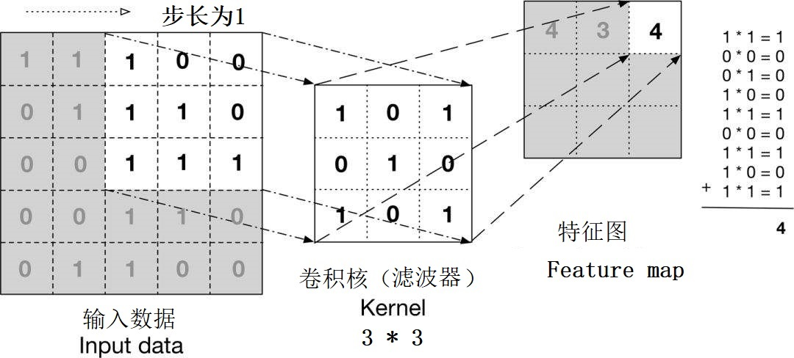
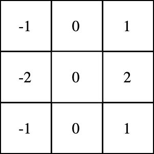
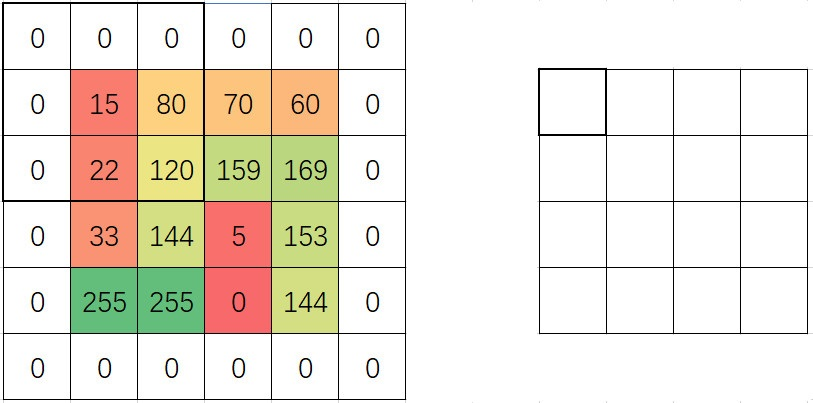
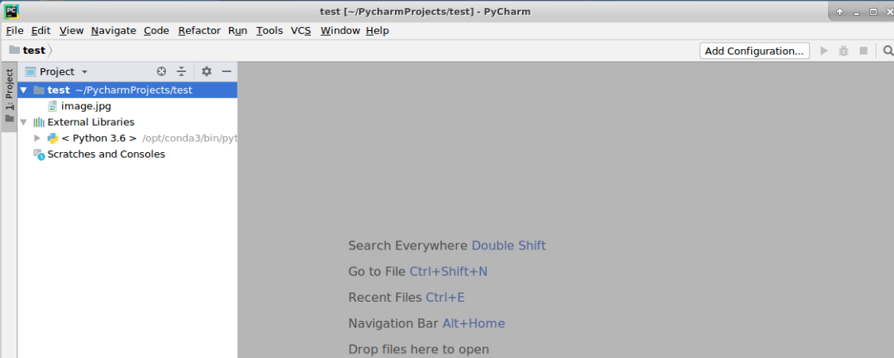
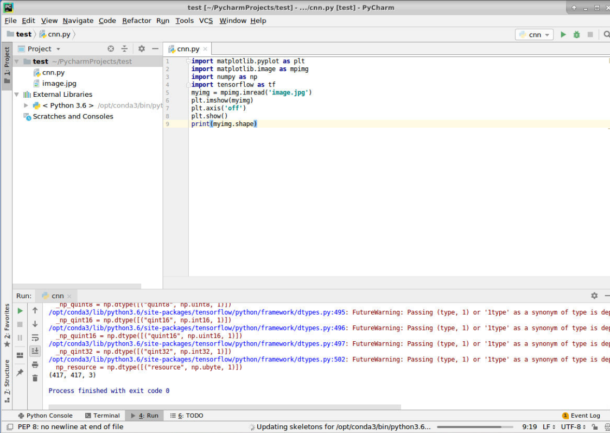
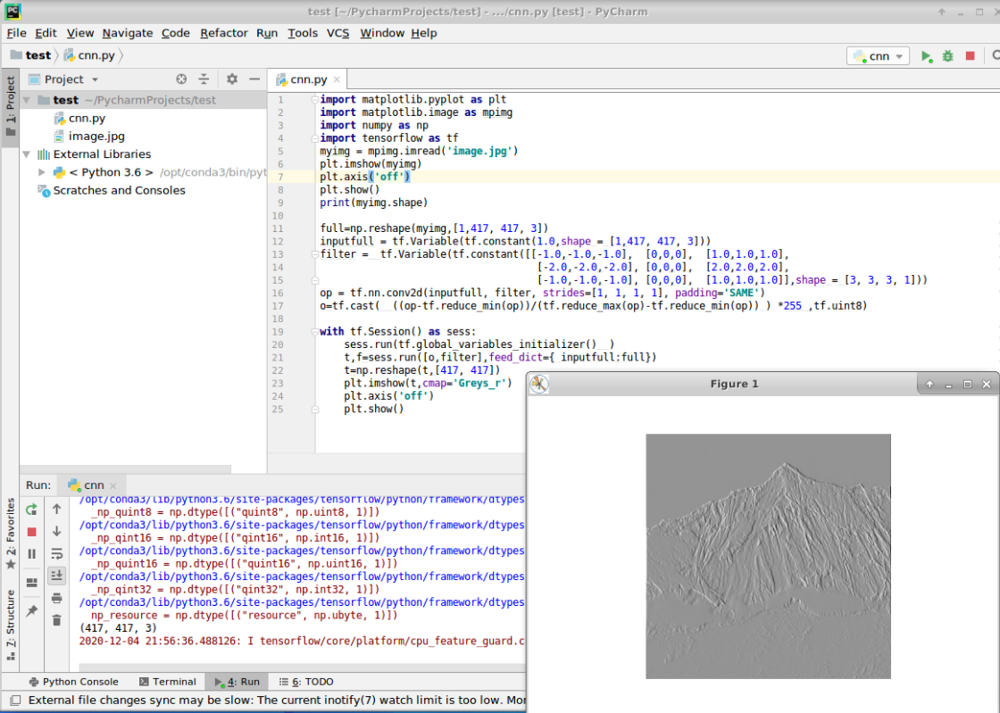
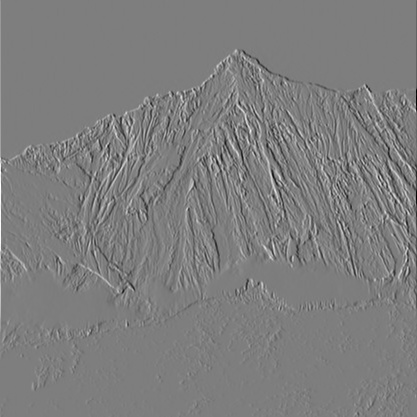

### **实验名称**

使用卷积提取图片的轮廓

### **实验目的**

通过实验掌握卷积神经网络是如何提取图片的轮廓

### **实验背景**

从卷积神经网络的提出到目前的广泛应用，大致经历了理论萌芽阶段、实验发展阶段以及大规模应用和深入研究阶段。

（1）理论萌芽阶段。1962年，大卫·休伯尔（David Hunter Hubel）和托斯坦·维厄瑟尔（Torsten Wiesel）通过生物学研究发现，从视网膜传递脑中的视觉信息是通过多层次的感受野（Receptive Field）激发完成的，并首先提出了感受野的概念。在卷积神经网络中，通过卷积层输出的图片称为feature map，feature map上的某个元素的计算受输入图像上感受野（卷积核）的影响。1980年日本学者Fukushima在基于感受野的基础上，提出了神经认知机(Neocognitron)，神经认知机可以理解为卷积神经网络的第一版。

（2）实验发展阶段。1998年Yann LeCun等提出了LeNet-5网络，其所采用的局部连接和权值共享的方式，一方面减少了权值的数量使得网络易于优化，另一方面降低了模型的复杂度，也就是减小了过拟合的风险。正是由于LeNet-5网络的提出，学术界开始了对于卷积神经网络的关注。同时，卷积神经网络在语音识别、物体检测、人脸识别等应用领域的研究也逐渐开展起来。

（3）大规模应用和深入研究阶段。在LeNet网络之后，卷积神经网络一直处于实验发展阶段，直到2012年卷积神经网络AlexNet的提出。AlexNet是2012年ImageNet竞赛冠军获得者Hinton和他的学生Alex Krizhevsky设计的，AlexNet在ImageNet的训练集上取得了图像分类的冠军，使得卷积神经网络成为计算机视觉中的重点研究对象，并且不断深入。也是在那年之后，更多的更深的神经网络被提出，比如微软的ResNet网络、牛津大学的VGG网络、谷歌的GoogLeNet网络。这些网络的提出使得卷积神经网络逐步开始走向商业化应用，几乎只要是存在图像的地方，就会有卷积神经网络的身影。

### **实验原理**

卷积神经网络是指使用卷积层的神经网络，卷积层由多个滤波器（网络结构中的filter）组成，滤波器可以看做二维数字矩阵，从数学上讲，卷积操作就是一种运算，下图描述了卷积操作的过程。

​

卷积过程​

依据上图的网络结构中对卷积层的描述，卷积层可包含输入数据，filter（卷积核），stride（步长），输出（feature map）。从图中可以看出滤波器与输入图像进行卷积操作产生输出数据，卷积操作的具体步骤如下：

1.确定输入数据大小为5×5，滤波器大小为3×3，步长为1，计算得出输出数据的大小为3×3，计算公式为（5-3)/2+1=3；

2.在输入图像的左上角选择与滤波器大小等同的区域；

3.将滤波器与图像左上角选中区域的值进行内积运算，将结果填入输出数据的对应位置；

4.将输入图像的选中区域按照步长向右移动，获得新的选中区域，如果移动到最右侧，将选中区域向下移动一个步长并回到最左侧，重复2.3步骤；

5.得到右侧的输出数据，在卷积神经网络中，被称为特征图。

#### 2、卷积作用

了解了卷积操作过程，再看看对图像求卷积的作用。确定输入图像为Lena照片，滤波器选用sobel滤波器，如下图所示。​

sobel滤波器​

通过滤波器与输入图像进行卷积操作，得出输出图像，如下图所示。从输出结果可以看出sobel滤波器提取了原始图像中的边缘特征，卷积可以找到特定的局部图像特征（如边缘），输出结果称为特征图feature map。如果当前卷积层有多个不同的滤波器，就可以得到不同的特征图，对应关系为N个滤波器产生N个特征图。

​

Lena图像sobel滤波输出

​3、卷积相关概念

步长是卷积操作的核心。通过步长的变换，可以得到不同类型的卷积操作，步长的作用在卷积操作的步骤中已经有所介绍，不再赘述。按照卷积输出结果与输入数据的大小不同，可以将卷积分为窄卷积、同卷积和全卷积。

窄卷积（valid卷积）是指生成的feature map比输入图像小，窄卷积的步长是可变的。如果步长为S，输入图像维度为N1×N1，卷积核的大小为N2×N2，则卷积后的图像大小（N1-N2）/S+1。

同卷积（same卷积）是指卷积后的feature map与输入图像大小一致，同卷积的步长是不可变的，滑动步长为1。同卷积一般都要使用padding技术（外围补0，以确保生成的尺寸不变），同卷积padding使用方式见下图。



​

padding同卷积示意图​

全卷积，即反卷积，生成的feature map会比输入图像要大，反卷积也需要使用padding技术，常用于反卷积神经网络。

卷积通道（Channel），卷积通道又分输入通道和输出通道。卷积输入通道数与图片颜色的通道数一致。如灰度图的通道为1，其对应的卷积输入通道也是1；RGB彩色图的通道是3，彩色图对应的卷积输入通道也为3。输出通道对应feature map，N个feature map对应N个卷积输出通道，也就是N个卷积核。

反向传播。卷积层反向传播的核心步骤主要包含如下两步：

（1）将误差反向传到上一层。

（2）根据误差反向更新学习参数的值。具体为使用链式求导法则，找到使误差最小化的梯度，再配合学习率算出更新的差值。更具体的算法请参考相关论文。

#### 4、卷积函数tf.nn.conv2d介绍

tf.nn.conv2d是TensorFlow里面实现卷积的函数。tf.nn.conv2d是对一个四维的输入数据 input 和四维的卷积核filter 进行操作,然后对输入的数据进行二维的卷积操作,得到卷积之后的结果,也是我们最常用的卷积函数。

tf.nn.conv2d是TensorFlow里面实现卷积的函数，实际上这是搭建卷积神经网络比较核心重要的一个方法，它的格式是：

```markup
 tf.nn.conv2d(input,filter,strides,padding,use_cudnn_on_gpu=None,name=None)
```

其中，各个参数的含义分别是：

*   input:指的是需要做卷积的输入图像，要求其为一个Tensor，拥有\[batch,in\_height,in\_width,in\_channels\]这些形状(shape)，详细地定义为"在训练时，一个batch的图片数量，图片高度，图片宽度，图片通道数"，需要注意的是此为一个四维的Tensor，要求类型是float32或float64。
    
*   filter：与CNN中的卷积核相似，要求其为一个Tensor，拥有\[filter\_height,filter\_width,in\_channels,out\_channels\]这些shape，详细地定义为"卷积核的高度，卷积核的宽度，图像通道数，滤波器个数"，被要求的类型和参数input一样。需要注意的是，第三维in\_channels即参数input中的第四维。
    
*   strides:卷积时在图像每一维的步长:一个长度为4的一维列表，每个元素跟data\_format互相对应，表示在data\_format每一维上的移动步长。当输入的默认格式为:“NHWC”，则strides = \[batch , in\_height ,in\_width, in\_channels\]。其中batch和in\_channels要求一定为1，即只能在一个样本的一个通道上的特征图上进行移动，in\_height，in\_width表示卷积核在特征图的高度和宽度上移动的步长。
    
*   padding：指的是定义元素边框与元素内容之间的空间。string类型的量只必须为"SAME"和“VALID”两者之一，不同的卷积方式被这个值决定。
    
*   use\_cudnn\_on\_gpu:bool类型，是否使用cudnn加速，默认为True。
    
*   name：指定名字。
    

#### 5、padding规则介绍

padding用来定义元素边框和内容之间的空间。

tf.nn.conv2d函数内，当变量padding是"SAME"或者"VALID"的时候，那么空间内的行列数是根据公式计算的。使之便于理解，首先定义下面几个变量:

*   输入的尺寸中高和宽：in\_height、in\_width。
    
*   输出的尺寸中高和宽：output\_height、output\_widh。
    
*   卷积核的高和宽：filter\_height、filter\_width。
    
*   步长的高宽方向：strides\_height、 strides\_width。
    

**1.VALID**情况：边缘不填充

输出宽和高的公式代码如下所示:

```markup
 output_width = (in_width - filter_width + 1)/strides_width 
 output_height = (in_height - filter_height + 1)/strides_height 
```

**2.SAME**情况：边缘填充

输出的宽和高与卷积核没有关系，公式代码如下所示:

```markup
 out_height = in_height / strides_height 
 out_width = in_width / strides_width 
```

此处有一个很关键的知识点——补零的规则：

```markup
 pad_height = max((out_height - 1) * strides_height + filter_height - in_height,0)
 pad_width = max((out_width - 1) * strides_width + filter_width - in_width, 0)
 pad_top = pad_height / 2
 pad_bottom = pad_height - pad_ top
 pad_left = pad_width / 2
 pad_right = pad_width - pad_left
```

补零的规则就是优先在输入矩阵的右边和底边处补零，举例：补零的行数为三行，那么top一行，bottom两行；补零的行数为一行，则补在bottom。因为filter是从上到下、从左向右滑动的，所以滑到底边或右边的时候可能会因为大步长而损失边界的信息，所以优先在底边和右边补零。

### **实验环境**

Ubuntu 16.04

Python 3.6

tensorflow 1.14.0

### **建议课时**

1个课时

### **实验步骤**

#### 一、前期准备

1、启动Pycharm，建立“test”工程目录。

2、在terminal终端输入以下代码，下载图片，将“/home/ubuntu/”下的image.jpg图片移动到“/home/ubuntu/PycharmProjects/test/”工程目录下。

```markup
 wget http://10.90.3.2/HUP/AI/NLP/image.jpg
```



#### 二、输入图片并显示

本例会将彩色图片生成带边缘化信息的图片。先输入一个例图，并使用一个3通道输入，1通道输出的3\*3卷积核”（即sobel算子），最后使用卷积函数输出生成结果。

在“test”目录下，新建一个“cnn.py”文件，并将图片放到该文件的同级“test”目录下，通过imread载入，然后将其显示并打印出来。具体代码如下：

```markup
import matplotlib.pyplot as plt # plt 用于显示图片
import matplotlib.image as mpimg # mpimg 用于读取图片
import numpy as np
import tensorflow as tf  
# 读取和代码处于同一目录下的图片
myimg = mpimg.imread('image.jpg') 
# 显示图片
plt.imshow(myimg) 
# 不显示坐标轴
plt.axis('off') 
plt.show()
print(myimg.shape)
```



由以上结果可知，这段代码的输出是(417, 417, 3)，说明载入图片的维度是417\*417大小，3个通道。

#### 三、定义占位符、卷积核、卷积op

在以上的“cnn.py”文件中加入以下代码。这里需要手动将sobel算子填入卷积核里。通过tf.constant函数可以将常量直接初始化到Variable中，因为有3个通道，所以sobel卷积核的每个元素都扩增成3个。

```markup
full=np.reshape(myimg,[1,417, 417, 3])
inputfull = tf.Variable(tf.constant(1.0,shape = [1,417, 417, 3]))

filter =  tf.Variable(tf.constant([[-1.0,-1.0,-1.0],  [0,0,0],  [1.0,1.0,1.0],
                                    [-2.0,-2.0,-2.0], [0,0,0],  [2.0,2.0,2.0],
                                    [-1.0,-1.0,-1.0], [0,0,0],  [1.0,1.0,1.0]],shape = [3, 3, 3, 1]))    
#3个通道输入，生成1个feature ma
op = tf.nn.conv2d(inputfull, filter, strides=[1, 1, 1, 1], padding='SAME') 
o=tf.cast(  ((op-tf.reduce_min(op))/(tf.reduce_max(op)-tf.reduce_min(op)) ) *255 ,tf.uint8)
```

上面的代码中，卷积op的步长为1×1，padding=’SAME‘表明这是个同卷积的操作。

#### 四、运行卷积操作及显示

再将以下代码添加到“cnn.py”文件并运行，运行结果如下所示。

```markup
with tf.Session() as sess:  
    sess.run(tf.global_variables_initializer()  )  
    t,f=sess.run([o,filter],feed_dict={ inputfull:full})
    t=np.reshape(t,[417, 417])
    # 显示图片
    plt.imshow(t,cmap='Greys_r') 
    # 不显示坐标轴
    plt.axis('off') 
    plt.show()
```



以下两图分别为原图和进行卷积操作之后图片的效果对比。


​

卷积提取图片轮廓原图

​



​

提取轮廓后的结果图​

### **实验总结**

sobel算子处理过的图片并不能保证每个像素都在\[0~255\]之间，所以要做一次归一化操作（即将每个值减去最小的结果，再除以最大值与最小值的差），让生成的值都在\[0,1\]之间，然后再乘以255。

卷积效果取决于卷积核，卷积核的大小不同，里面的值不同，卷积后的效果就会不同的，我们可以自行设计不同的卷积核进行试验。