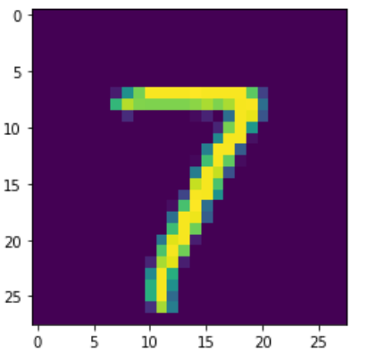

### 实验名称

实验5 使用maxout网络实现MNIST分类

### 实验目的

了解神经元的工作原理及Maxout网络的作用 熟悉神经网络模型的创建、训练和预测的流程 掌握梯度下降的原理及实际应用

### 实验背景

激活函数（Activation Function），就是在人工神经网络的神经元上运行的函数，负责将神经元的输入映射到输出端。Maxout是深度学习网络中的一层网络，就像池化层、卷积层一样等，Maxout网络可以理解为单个神经元的扩展，主要是扩展单个神经元里面的激活函数。

MNIST数据集是机器学习领域中非常经典的一个数据集，由60000个训练样本和10000个测试样本组成，每个样本都是一张28 \* 28像素的灰度手写数字图片。

### 实验原理

Maxout网络可以理解为单个神经元的扩展，主要是扩展单个神经元里面的激活函数，正常的单个神经元如下图所示。


图6-10 单个神经元

假设网络第i层有2个神经元​、​，第i+1层的神经元个数为1个，以前MLP的方法。要计算第i+1层，那个神经元的激活值的时候，传统的MLP计算公式就是：

$$

z=W\ast X+b

$$

$$

out=f\left(z\right)

$$

其中 f 就是所谓的激活函数，比如Sigmod、Relu、Tanh等。

而在Maxout 网络里面，如果设置Maxout的参数k=n，Maxout层就如下所示：


图6-11 Maxout网络

相当于在每个输出神经元前面又多了一层。这一层有n个神经元，此时Maxout网络的输出计算公式为：

$$

z_1=w_1*x+b_1

$$

$$

z_2=w_2*x+b_2

$$

$$

z_3=w_3*x+b_3

$$

$$

z_4=w_4*x+b_4

$$

$$

z_5=w_5*x+b_5

$$

......

out=max($z_1,z_2,z_3,z_4,z_5......$)

Maxout是将激活函数变成一个网络选择器，原理就是将多个神经元并列地放在一起，从它们的输出结果中找到最大的那个，代表对特征响应最敏感，然后取这个神经元的结果参与后面的运算。相当于同时使用多个神经元放在一起，哪个有效果就用哪个。所以这样的网络会有更好的拟合效果。

### 实验环境

ubuntu 16.04 numpy 1.16.4 tensorflow 1.5 matplotlib 3.1.1

### 实验步骤

打开终端


输入jupyter notebook打开jupyter开发环境


弹出浏览器，创建python3文件


jupyter环境打开完成


由公网下载数据操作如下：

重新打开一个新的终端窗口，并执行如下命令，进行数据下载及解压：

```markup
wget http://10.90.3.2/HUP/AI/NLP/MNIST_data.zip
unzip MNIST_data.zip
```

通过input\_data.read\_data\_sets方法加载MNIST数据集。

```python
 from tensorflow.examples.tutorials.mnist import input_data
 mnist = input_data.read_data_sets("MNIST_data/")
```


查看MNIST数据集。分别查看训练集、测试集及验证集的基本情况。

```python
 print ('输入数据:',mnist.train.images)
 print ('训练集数据的shape:',mnist.train.images.shape)
 print ('测试集数据的shape:',mnist.test.images.shape)
 print ('验证集数据的shape:',mnist.validation.images.shape)
```


我们可以使用pylab.imshow方法，查看MNIST数据集所对应的手写数字。

```python
 import pylab
 # 读取下标为1的图形，返回所对应的numpy.ndarray数据
 im = mnist.train.images[1]
 # 将im数组形状设置为28*28
 im = im.reshape(-1,28)
 pylab.imshow(im)
 pylab.show()
```



这里我们定义方法max\_out，以获取Maxout输出，具体实现如下。

```python
import tensorflow as tf
 def max_out(inputs, num_units, axis=None):
     '''
    inputs: 上一层的输出的结果，这里需要上一层的输出结果的维度是k*m
    num_units:激活后的最终的输出结果数m
    '''
     shape = inputs.get_shape().as_list()
     if shape[0] is None:
         shape[0] = -1
     if axis is None:  
         #假设channel是最后一个维度
         axis = -1
     num_channels = shape[axis]
     if num_channels % num_units:
         raise ValueError('number of features({}) is not '
                          'a multiple of num_units({})'.format(num_channels, num_units))
     shape[axis] = num_units
     shape += [num_channels // num_units]
     outputs = tf.reduce_max(tf.reshape(inputs, shape), -1, keep_dims=False)
     return outputs
```

在网络模型部分，添加一层Maxout，然后将Maxout作为maxsoft的交叉熵输入。

```python
# 清除默认图形堆栈并重置全局默认图形
 tf.reset_default_graph()
 # placeholder()函数是在神经网络构建graph的时候在模型中的占位，
 # 此时并没有把要输入的数据传入模型，它只会分配必要的内存。
 # 等建立session，在会话中，运行模型的时候通过feed_dict()函数向占位符喂入数据
 # 定义数据属性及结果的占位符
 # mnist data维度 28*28=784
 x = tf.placeholder(tf.float32, [None, 784])
 # 0-9 数字=> 10 classes
 y = tf.placeholder(tf.int32, [None])
 ​
 # 设置模型权重
 # tf.Variable 生成的是一个张量
 # 分别生成用于计算激活值的W,b两个变量
 W = tf.Variable(tf.random_normal([784, 100]))
 b = tf.Variable(tf.zeros([100]))
 # 生成神经元的激活值张量，对应公式z = W * x + b
 z= tf.matmul(x, W) + b
 # 调用max_out方法，得到Maxout激活后输出单元数为50
 maxout= max_out(z, 50)
 ​
 ​
 W2 = tf.Variable(tf.truncated_normal([50, 10], stddev=0.1))
 b2 = tf.Variable(tf.zeros([10]))
 # 使用Maxout构建预测模型
 pred = tf.matmul(maxout, W2) + b2
 ​
 # 使用交叉熵最小化误差
 cost = tf.reduce_mean(tf.nn.sparse_softmax_cross_entropy_with_logits(labels=y, logits=pred))
 ​
 #学习率参数设置
 learning_rate = 0.04
 # 使用梯度下降优化器
 optimizer = tf.train.GradientDescentOptimizer(learning_rate).minimize(cost)
```

具体处理过程如下：

```python
# 迭代所有训练集次数，具体可根据情况进行修改
 training_epochs = 200
 # 单次迭代样本数，具体可根据情况进行修改
 batch_size = 100
 # 迭代过程打印频次，具体可根据情况进行修改
 display_step = 1
 with tf.Session() as sess:
     # 初始化tf变量
     sess.run(tf.global_variables_initializer())
     # 启动循环开始训练
     for epoch in range(training_epochs):
         avg_cost = 0.
         total_batch = int(mnist.train.num_examples/batch_size)
         # 遍历全部数据集
         for i in range(total_batch):
             # 获取数据集属性及标签
             batch_xs, batch_ys = mnist.train.next_batch(batch_size)
             # 执行sess.run，使用optimization（梯度下降优化器）和cost(交叉熵最小化误差)计算损失值
             print(optimizer,cost)
             _, c = sess.run([optimizer, cost], feed_dict={x: batch_xs,
                                                           y: batch_ys})
             
             # 计算平均损失
             avg_cost += c / total_batch
             print(avg_cost,c)
         # 显示训练中的详细信息
         if (epoch+1) % display_step == 0:
             print ("Epoch:", '%04d' % (epoch+1), "cost=", "{:.9f}".format(avg_cost))
 ​
     print( " Finished!")
```

程序运行结果如下，具体cost值，根据实际运行环境不同会有差异：

 Epoch: 0001 cost= 2.003071311  
 Epoch: 0002 cost= 0.911839795  
 Epoch: 0003 cost= 0.706105462  
 Epoch: 0004 cost= 0.620341359  
 Epoch: 0005 cost= 0.576126413  
 ......  
 Epoch: 0196 cost= 0.147924060  
 Epoch: 0197 cost= 0.144809078  
 Epoch: 0198 cost= 0.149507618  
 Epoch: 0199 cost= 0.145549403  
 Epoch: 0200 cost= 0.146550539  
  Finished!

### 实验总结

通过实验，我们可以发现maxout非线性的拟合能力是更强的，因为参数更多，而且可学习。