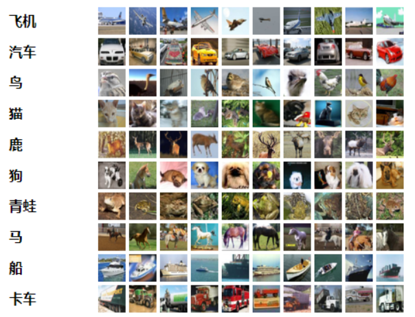
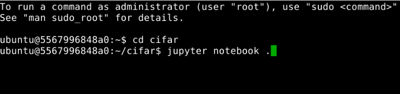
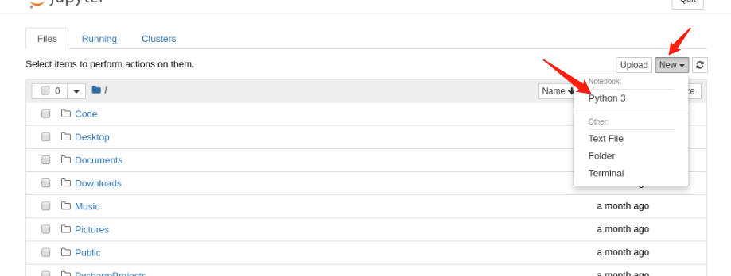
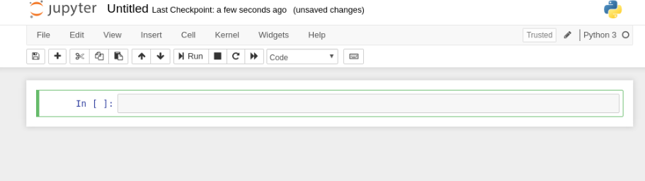
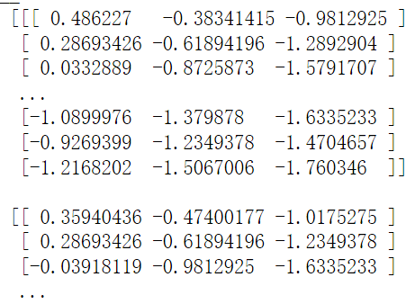
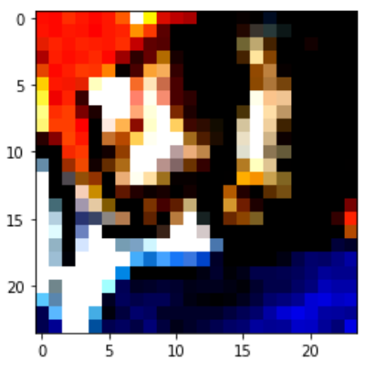
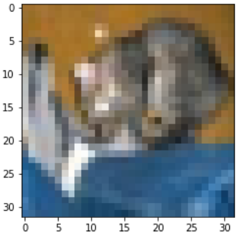

### 实验名称

CIFAR数据集的导入及处理

### 实验目的

了解CIFAR数据集如何下载和使用及cifar10\_input相关功能 掌握CIFAR数据集处理的方法

### 实验背景

**CIFAR介绍**

CIFAR是从Alex Krizhevsky、Vinod Nair和Geoffrey Hinton中采集而来。早期的数据集常以CIFAR-10命名。

CIFAR-10数据集由60000个32×32彩色图像组成，图像包含10个类别，每个类别包含6000个图像。其中数据集有50000个训练图像和10000个测试图像，分为五个训练批次和一个测试批次，每个批次有10000个图像。训练批次以随机顺序包含剩余图像，但一些训练批次可能包含来自一个类别的图像比另一个更多。测试批次包含来自每个类别的恰好1000个随机选择的图像。总体来说，五个训练集之和包含来自每个类的5000张图像。 下图是数据集中的10个类，以及来自每个类的10个随机图像：



### 实验原理

cifar10\_input.inputs为专获取数据的函数，返回数据集和对应的标签，但cifar10\_input.inputs能自动裁剪图片，通过原来的32×32×3变成24×24×3。该函数默认使用测试数据集，倘若运用训练数据集，能把第一个参数传入eval\_data=False，然后再batch\_size和dir传入，就能得到dir下面的batch\_size个数据。

需要注意的是这里得到的图片并不是原始图片，是进行了两次变换，第一次把32×32尺寸裁剪成24尺寸，接下来又进行了一次图片标准化（减去均值像素，并除以像素方差）。优势在于，让全部的输入全都在一个有效的数据分布之内，方便特征的分类处理，能让梯度下降算法的收敛更快。

### 实验环境

ubuntu 16.04 python 3.6.5 tensorflow 1.5.0 matplotlib 3.1.1 cifar10 cifar10\_input

### 建议课时

1课时

### 实验步骤

打开终端


下载cifar10数据集及内置cifar10、cifar10\_input代码包。

在终端中输入如下命令进行下载及解压

```markup
wget http://10.90.3.2/HUP/AI/DP/cifar.zip
unzip cifar.zip
cd cifar
```

输入jupyter notebook打开jupyter开发环境，注意此处是命令最后要加上"."，将jupyter notebook启动路径修改为当前路径。



弹出浏览器，创建python3文件



jupyter环境打开完成



首先需要通过import cifar10\_input来导入CIFAR数据集，从而了解CIFAR数据集的导入与显示。

引入相关包

```python
import cifar10
import cifar10_input
import tensorflow as tf
import pylab
```

加载图片数据：

```python
#取数据
batch_size = 12
data_dir = './cifar-10-batches-bin/'
# 使用inputs方法上读取cifar数据
# eval_data：读取训练集或测试集数据，True表示使用测试集
# data_dir：数据集目录
# batch_size：每批图像的数量
# 返回：图片4维(batch_size, IMAGE_SIZE, IMAGE_SIZE, 3)张量及标签
images_test, labels_test = cifar10_input.inputs(eval_data = True, data_dir = data_dir, batch_size = batch_size)
# 新建session对象
sess = tf.InteractiveSession()
# 初始化模型的参数
tf.global_variables_initializer().run()
# 运行程序，启动填充队列的线程
tf.train.start_queue_runners()
# 进行图的计算
image_batch, label_batch = sess.run([images_test, labels_test])
print("__\n",image_batch[0])
print("__\n",label_batch[0])
pylab.imshow(image_batch[0])
pylab.show()
```



读取的数据都是进过标准化处理的（变成了均值为0，方差为1的数据分布），所以输出的图片就是乱的



下面我们显示CIFAR数据集的原始图片。

```python
import numpy as np   
 
filename = './cifar-10-batches-bin/test_batch.bin'
# 读取文件并设置读取的缓存
bytestream = open(filename, "rb")  
buf = bytestream.read(10000 * (1 + 32 * 32 * 3))  
bytestream.close()  
 
# 读取数据流，转换为ndarray
data = np.frombuffer(buf, dtype=np.uint8)  
data = data.reshape(10000, 1 + 32*32*3)
# 数据分割
labels_images = np.hsplit(data, [1]) 
# 获取标签及对应图片向量
labels = labels_images[0].reshape(10000)  
images = labels_images[1].reshape(10000, 32, 32, 3)  
#导出第一幅图    
img = np.reshape(images[0], (3, 32, 32)) 
# 向量转置
img = img.transpose(1, 2, 0)  
# 打印图片
import pylab
print(labels[0])
pylab.imshow(img)
pylab.show()
```



在图像加载前，会进行相应处理，下面我们来看下CIFAR数据集处理。

新打开一个终端并在终端中执行如下命令，下载cifar-10对应的python版本数据集：

```markup
wget http://10.90.3.2/HUP/AI/DP/cifar-10-python.tar.gz
tar -xvf cifar-10-python.tar.gz
```

该数据集文件包含data\_batch1……data\_batch5和test\_batch。他们都是由cPickle库产生的、经过序列化后的对象，这里给出python2和python3的代码，可以打开pkl文件，返回一个字典结构的数据：

```python
import numpy as np
import random
import pickle
import platform
import os
 
#加载序列文件
def load_pickle(f):
#判断python的版本
    version=platform.python_version_tuple()
    if version[0]== '2':
        # 2.*版本 ：直接load
        return pickle.load(f)
    elif version[0]== '3':
        # 3.*版本 ：设置文件编码格式为'latin1'
        return pickle.load(f,encoding='latin1')
    # 其它版本的，抛出异常
    raise ValueError("invalid python version:{}".format(version))
```

经上述代码，传入的每个batch文件，返回的是一个字典，该字典包含有：

*   labels 对应的值是一个长度为10000的列表，每个数字取值范围 0~9，代表当前图片所属类别
    
*   data 10000 \* 3072 的二维数组，每一行代表一张图片的像素值。（32_32_3=3072）
    

数据集除了6个batch之外，还有一个文件batches.meta。它包含一个python字典对象，内容有：一个包含10个元素的列表，每一个描述了labels array中每个数字对应类标的名字。比如：label\_names\[0\] == "airplane", label\_names\[1\] == "automobile"。

```python
# 按batch加载数据文件
def load_CIFAR_batch(filename):
    with open(filename,'rb') as f:
        # 按python版本加载文件数据
        datadict=load_pickle(f)
        # 分别获取数据及标签
        X=datadict['data']
        Y=datadict['labels']
        # 改变X的形状，并对其进行转置，由0，1，2，3转置为0,2,3,1
        X=X.reshape(10000,3,32,32).transpose(0,2,3,1).astype("float")
        Y=np.array(Y)
        return X,Y
```

加载数据集：

```python
#返回可以直接使用的数据集
def load_CIFAR10(ROOT):
    xs=[]
    ys=[]
    # 获取训练集数据
    for b in range(1,6):
        #os.path.join()将多个路径组合后返回
        f=os.path.join(ROOT,'data_batch_%d'%(b,))
        X,Y=load_CIFAR_batch(f)
        xs.append(X)
        ys.append(Y)
    #这个函数用于将多个数组进行连接
    # 训练集属性
    Xtr=np.concatenate(xs)
    # 训练集标签
    Ytr=np.concatenate(ys)
    del X,Y
    # 获取测试集属性及标签
    Xte,Yte=load_CIFAR_batch(os.path.join(ROOT,'test_batch'))
    return Xtr,Ytr,Xte,Yte
```

测试代码如下：：

```python
datasets='../cifar-10-batches-py'
# 加载数据，并得到训练集及测试集
X_train,Y_train,X_test,Y_test=load_CIFAR10(datasets)
print('Training data shape: ', X_train.shape)
print('Training labels shape: ', Y_train.shape)
print('Test data shape: ', X_test.shape)
print('Test labels shape: ', Y_test.shape)
```

经上述处理后，对原始CIFAR-10数据集的处理，返回结果如下：

Training data shape:  (50000, 32, 32, 3)
Training labels shape:  (50000,)
Test data shape:  (10000, 32, 32, 3)
Test labels shape:  (10000,)

### 实验总结

通过对cifar-10数据的加载、处理及显示过程的操作，了解CIFAR数据集如何下载和使用及cifar10\_input相关功能，并了解图像类数据的处理方法。