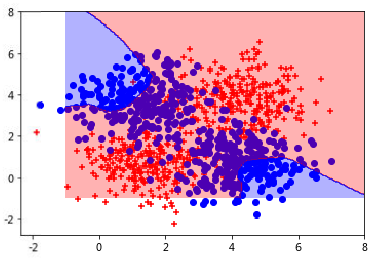

### **实验名称**

全连接网络模型的优化方法

### **实验目的**

1.理解训练神经网络的欠拟合和过拟合概念

2.掌握全连接神经网络模型的训练技巧和优化方法

### **实验背景**

本实验将使用generate函数生成4类数据，并将其中的两类数据进行合并，便得到异或特征的数据集。然后使用神经网络进行训练，发现出现的欠拟合和过拟合问题，并使用训练技巧和优化方法来改善拟合问题，这是神经网络模型训练和优化的基本流程。

### **实验原理**

神经网络(neural networks)的训练会出现欠拟合问题或者过拟合问题。

**欠拟合**

欠拟合就是模型没有很好地捕捉到数据特征，不能够很好地拟合数据。在神经网络训练中，表现为无法精准地学习到适合的模型参数，对此，可以采用增加节点或增加层的方式，让模型具有更高的拟合性，从而降低模型的训练难度。

**过拟合**

为了得到一致假设而使假设变得过度严格称为过拟合。一个假设在训练数据上能够获得比其他假设更好的拟合， 但是在训练数据外的数据集上却不能很好地拟合数据，此时认为这个假设出现了过拟合的现象。出现这种现象的主要原因是训练数据中存在噪音或者训练数据太少。对于神经网络来说，a)对样本数据可能存在分类决策面不唯一，随着学习的进行,，BP算法使权值可能收敛过于复杂的决策面；b)权值学习迭代次数足够多(Overtraining)，拟合了训练数据中的噪声和训练样例中没有代表性的特征。常用的解决办法如下，更详细内容见后：

*   正则化
    
*   增大数据集合
    
*   Dropout技术
    

### **实验环境**

Ubuntu 16.04

Python 3.6

Numpy 1.18.3

TensorFlow 1.5.0

### **建议课时**

6课时

### **实验步骤**

打开jupyter-notebook，创建一个python3文件，将文档保存为8.x.ipynb文件（x=1，2，3等，表示以下各步骤的优化步骤和方法）

```markup
jupyter-notebook
```


​

图1 jupyter环境

​

整个实验按照如下步骤完成：

*   利用异或数据集演示过拟合问题
    
*   通过正则化改善过拟合情况
    
*   通过增大数据集改善过拟合
    
*   基于Dropout技术来拟合异或数据集
    

#### 一、利用异或数据集演示过拟合问题

首先构建具有异或特征的数据集，先构建一个简单的多层神经网络来拟合其样本特征，观察欠拟合的现象，通过全连接网络将它们进行分类，后续通过调整数据节点的数量来演示过拟合问题。

##### 1.1 构建异或特征的数据集

先引入库并定义generate生成函数。

```python
#引入库
import tensorflow as tf
import numpy as np
import matplotlib.pyplot as plt
#引入相应函数和编码
from sklearn.utils import shuffle
from matplotlib.colors import colorConverter, ListedColormap
from sklearn.preprocessing import OneHotEncoder

#定义独热编码
def onehot(y, start, end):
    ohe = OneHotEncoder()
    #在指定的间隔内返回均匀间隔的数字
    a = np.linspace(start, end - 1, end - start)
    b = np.reshape(a, [-1, 1]).astype(np.int32)
    ohe.fit(b)
    c = ohe.transform(y).toarray()
    return c

#定义generate函数生成4类数据
def generate(sample_size, num_classes, diff, regression=False):
    #种子值10
    np.random.seed(10)
    #生成均值的随即数
    mean = np.random.randn(2)
    #协方差矩阵
    cov = np.eye(2)
    #每一类采样个数
    samples_per_class = int(sample_size / num_classes)

    #生成多元正态分布的数组
    X0 = np.random.multivariate_normal(mean, cov, samples_per_class)
    Y0 = np.zeros(samples_per_class)

    for ci, d in enumerate(diff):
        #平移均值后生成多元正态分布的数组
        X1 = np.random.multivariate_normal(mean + d, cov, samples_per_class)
        Y1 = (ci + 1) * np.ones(samples_per_class)

        #X0，Y0与循环生成的X1，Y1连接
        X0 = np.concatenate((X0, X1))
        Y0 = np.concatenate((Y0, Y1))

    if regression == False:  # one-hot  0 into the vector "1 0"
        #Y0变成独热编码
        Y0 = np.reshape(Y0, [-1, 1])
        Y0 = onehot(Y0.astype(np.int32), 0, num_classes)
    X, Y = shuffle(X0, Y0)
    return X, Y
```

调用generate函数生成4类数据，并将其中的两类数据进行合并，便得到异或特征的数据集，实现代码如下。

```python
np.random.seed(10)
input_dim = 2
num_classes =4
#调用generate函数生成4类数据，共320个数据
X, Y = generate(320,num_classes, [[3.0,0],[3.0,3.0],[0,3.0]],True)
#分成两组，Y=0或者1
Y=Y%2

#定义分割X为异或数据集合，根据Y=0或者1，标识X为红色点或者蓝色点数据集
xr=[]
xb=[]
for(l,k) in zip(Y[:],X[:]):
    if l == 0.0 :
        xr.append([k[0],k[1]])
    else:
        xb.append([k[0],k[1]])
#红色和蓝色数据集合可视化
xr =np.array(xr)
xb =np.array(xb)
plt.scatter(xr[:,0], xr[:,1], c='r',marker='+')
plt.scatter(xb[:,0], xb[:,1], c='b',marker='o')
plt.show()
#调整Y的矩阵形状为列式样
Y = np.reshape(Y, [-1, 1])
```

运行上面的代码，可以得到分为两类的数据集，如下图所示：


​

图2 异或数据集

​

##### 1.2 简单的多层神经网络

构建简单的多层神经网络，并对构建的网络进行训练，当隐藏层设置为2时，因为训练层级较少，会出现欠拟合现象。实现代码如下：

```python
learning_rate = 1e-4
n_input = 2
n_label = 1
# 隐藏层为2，此种情况训练模型会出现欠拟合
n_hidden = 2

# 使用placeholder定义过程，在执行的时候再赋具体的值
x = tf.placeholder(tf.float32, [None, n_input])
y = tf.placeholder(tf.float32, [None, n_label])
# 权重值
weights = {
    'h1': tf.Variable(tf.truncated_normal([n_input, n_hidden], stddev=0.1)),
    'h2': tf.Variable(tf.random_normal([n_hidden, n_label], stddev=0.1))
}
# 偏移量
biases = {
    'h1': tf.Variable(tf.zeros([n_hidden])),
    'h2': tf.Variable(tf.zeros([n_label]))
}
# 定义线性整流函数（Rectified Linear Unit, ReLU）
layer_1 = tf.nn.relu(tf.add(tf.matmul(x, weights['h1']), biases['h1']))
layer2 = tf.add(tf.matmul(layer_1, weights['h2']), biases['h2'])
# 预测值
y_pred = tf.maximum(layer2, 0.01 * layer2)

# 损失值
loss = tf.reduce_mean((y_pred - y) ** 2)
# 训练步骤
train_step = tf.train.AdamOptimizer(learning_rate).minimize(loss)

# 加载，初始化
sess = tf.InteractiveSession()
sess.run(tf.global_variables_initializer())
# 循环运行20000此
for i in range(20000): 

    _, loss_val = sess.run([train_step, loss], feed_dict={x: X, y: Y})

    # 打印训练步骤和损失值，每1000步打印一次
    if (i+1) % 1000 == 0:
        print("Step:", i+1, "Current loss:", loss_val)
```

运行结果如下：

```markup
Step: 1000 Current loss: 0.32757917
Step: 2000 Current loss: 0.26965505
Step: 3000 Current loss: 0.26535743
Step: 4000 Current loss: 0.26123744
Step: 5000 Current loss: 0.2571529
...
Step: 18000 Current loss: 0.24994357
Step: 19000 Current loss: 0.24994354
Step: 20000 Current loss: 0.24994354
```

##### 1.3 简单多层神经网络分类结果可视化

生成120数据点放到上面训练好的简单多层神经网络的模型里，并将其显示在直角坐标系中，实现代码如下：

```python
# 使用generate函数生成120个异或数据集合
xTrain, yTrain = generate(120,num_classes, [[3.0,0],[3.0,3.0],[0,3.0]],True)
# 0或1分类，可视化红色或者蓝色数据集
yTrain=yTrain%2
xr=[]
xb=[]
for(l,k) in zip(yTrain[:],xTrain[:]):
    if l == 0.0 :
        xr.append([k[0],k[1]])
    else:
        xb.append([k[0],k[1]])
xr =np.array(xr)
xb =np.array(xb)
plt.scatter(xr[:,0], xr[:,1], c='r',marker='+')
plt.scatter(xb[:,0], xb[:,1], c='b',marker='o')
yTrain=np.reshape(yTrain,[-1,1])
# 120个测试数据集合的测试结果
print ("loss:\n", sess.run(loss, feed_dict={x: xTrain, y: yTrain}))

nb_of_xs = 200
xs1 = np.linspace(-1, 8, num=nb_of_xs)
xs2 = np.linspace(-1, 8, num=nb_of_xs)
# 创建grid
xx, yy = np.meshgrid(xs1, xs2) 
# 初始和填充 classification plane
classification_plane = np.zeros((nb_of_xs, nb_of_xs))
for i in range(nb_of_xs):
    for j in range(nb_of_xs):
        classification_plane[i,j] = sess.run(y_pred, feed_dict={x:[[ xx[i,j], yy[i,j] ]]} )
        classification_plane[i,j] = int(classification_plane[i,j])

# 创建一个color map用来显示每一个格子的分类颜色
cmap = ListedColormap([
    colorConverter.to_rgba('r', alpha=0.30),
    colorConverter.to_rgba('b', alpha=0.30)])
# 图示样本的分类边界
plt.contourf(xx, yy, classification_plane, cmap=cmap)
plt.show()
```

代码运行结果：


​

图3 欠拟合效果

​

可以比较清楚的看到以上的分类效果很差，运行结果是欠拟合的。

##### 1.4 模型调整

上面欠拟合的效果可知简单多层神经网络在处理异或数据集分类问题上效果不够理想，究其原因可以发现，导致出现欠拟合问题是由于无法精准地学习到适合的模型参数，对此，可以采用增加节点或增加层的方式，让模型具有更高的拟合性，从而降低模型的训练难度。 将隐藏层的节点提高到200，即在构建网络模型时，参数n\_hidden = 200，对网络模型进行训练，并将数据集进行可视化，可发现数据划分效果明显提升。模型训练代码：

```python
learning_rate = 1e-4
n_input = 2
n_label = 1
# 隐藏层的节点数提高为200
n_hidden = 200

# 使用placeholder定义过程，在执行的时候再赋具体的值
x = tf.placeholder(tf.float32, [None, n_input])
y = tf.placeholder(tf.float32, [None, n_label])
# 权重值
weights = {
    'h1': tf.Variable(tf.truncated_normal([n_input, n_hidden], stddev=0.1)),
    'h2': tf.Variable(tf.random_normal([n_hidden, n_label], stddev=0.1))
}
# 偏移量
biases = {
    'h1': tf.Variable(tf.zeros([n_hidden])),
    'h2': tf.Variable(tf.zeros([n_label]))
}
# 线性整流函数
layer_1 = tf.nn.relu(tf.add(tf.matmul(x, weights['h1']), biases['h1']))
layer2 = tf.add(tf.matmul(layer_1, weights['h2']), biases['h2'])
y_pred = tf.maximum(layer2, 0.01 * layer2)

loss = tf.reduce_mean((y_pred - y) ** 2)
train_step = tf.train.AdamOptimizer(learning_rate).minimize(loss)

# 加载和初始化
sess = tf.InteractiveSession()
sess.run(tf.global_variables_initializer())
for i in range(20000):  #

    _, loss_val = sess.run([train_step, loss], feed_dict={x: X, y: Y})

    #每1000步输出结果
    if (i+1) % 1000 == 0:
        print("Step:", i+1, "Current loss:", loss_val)
```

运行结果如下：

```markup
Step: 1000 Current loss: 0.10615991
Step: 2000 Current loss: 0.08689711
Step: 3000 Current loss: 0.07765286
Step: 4000 Current loss: 0.07118706
Step: 5000 Current loss: 0.06779228
...
Step: 18000 Current loss: 0.049122162
Step: 19000 Current loss: 0.047707327
Step: 20000 Current loss: 0.046425022
```

测试的全部320个数据集合的划分效果图代码如下：

```python
# 320个数据集合的划分为两类，并展示为红色和蓝色数据集合
xr = []
xb = []
for (l, k) in zip(Y[:], X[:]):
    if l == 0.0:
        xr.append([k[0], k[1]])
    else:
        xb.append([k[0], k[1]])
xr = np.array(xr)
xb = np.array(xb)
plt.scatter(xr[:, 0], xr[:, 1], c='r', marker='+')
plt.scatter(xb[:, 0], xb[:, 1], c='b', marker='o')

# 生成网格数据并进行涂色
nb_of_xs = 200
xs1 = np.linspace(-3, 10, num=nb_of_xs)
xs2 = np.linspace(-3, 10, num=nb_of_xs)
# 生成网格
xx, yy = np.meshgrid(xs1, xs2)  # create the grid
classification_plane = np.zeros((nb_of_xs, nb_of_xs))
for i in range(nb_of_xs):
    for j in range(nb_of_xs):
        classification_plane[i, j] = sess.run(y_pred, feed_dict={x: [[xx[i, j], yy[i, j]]]})
        classification_plane[i, j] = int(classification_plane[i, j])
# 地图着色
cmap = ListedColormap([
    colorConverter.to_rgba('r', alpha=0.30),
    colorConverter.to_rgba('b', alpha=0.30)])

plt.contourf(xx, yy, classification_plane, cmap=cmap)
plt.show()
```

代码运行结果如下：


​

图4 全连接网络320个数据集划分效果图

​

##### 1.5 过拟合效果模拟

通过上面的实验可发现，全连接网络在处理较大量数据集节点划分问题时，效果比较突出，但处理少量数据集节点划分时，效果并不理想，例如，处理12个数据节点划分时，只需将上面代码中generate函数的第一个参数修改为12即可，即：

```python
xTrain, yTrain = generate(12,num_classes, [[3.0,0],[3.0,3.0],[0,3.0]], True)
```

完整代码为：

```python
#生成120个数据集合，进行异或分类，同时进行红色和蓝色数据集合区分
xTrain, yTrain = generate(12,num_classes, [[3.0,0],[3.0,3.0],[0,3.0]],True)
yTrain=yTrain%2
xr=[]
xb=[]
for(l,k) in zip(yTrain[:],xTrain[:]):
    if l == 0.0 :
        xr.append([k[0],k[1]])
    else:
        xb.append([k[0],k[1]])
xr =np.array(xr)
xb =np.array(xb)
plt.scatter(xr[:,0], xr[:,1], c='r',marker='+')
plt.scatter(xb[:,0], xb[:,1], c='b',marker='o')
yTrain=np.reshape(yTrain,[-1,1])
print ("loss:\n", sess.run(loss, feed_dict={x: xTrain, y: yTrain}))

nb_of_xs = 200
xs1 = np.linspace(-1, 8, num=nb_of_xs)
xs2 = np.linspace(-1, 8, num=nb_of_xs)
# 生成网格
xx, yy = np.meshgrid(xs1, xs2) 
# 生成训练结果
classification_plane = np.zeros((nb_of_xs, nb_of_xs))
for i in range(nb_of_xs):
    for j in range(nb_of_xs):
        classification_plane[i,j] = sess.run(y_pred, feed_dict={x:[[ xx[i,j], yy[i,j] ]]} )
        classification_plane[i,j] = int(classification_plane[i,j])

# 地图着色
cmap = ListedColormap([
    colorConverter.to_rgba('r', alpha=0.30),
    colorConverter.to_rgba('b', alpha=0.30)])
# 可视化拟合效果
plt.contourf(xx, yy, classification_plane, cmap=cmap)
plt.show()
```

运行代码可发现，同样使用全连接网络模型，但是划分出来的效果并不是很理想， 这种现象就是过拟合，如下图所示：


​

图5 过拟合效果

​

过拟合与欠拟合一样都是在训练模型中不愿意看到的现象，为了得到在测试情况下表现出良好的训练效果，需要对全连接网络模型进行优化，接下来将介绍几种常用的优化方法。

#### 二、通过正则化改善过拟合情况

全连接网络模型优化方法很多，首先介绍最常用的通过正则化改善过拟合的方法。

##### 2.1 正则化

所谓的正则化，也叫Regulization，简单来说，正则化也就是一种为了减小测试误差的行为。其实就是在神经网络计算损失值的过程中，在损失后面再加一项，这样损失值所代表的输出与标准结果间的误差就会受到干扰，导致学习参数无法按照目标方向来调整，从而实现模型无法与样本完全拟合的结果，最终目的是让模型在面对新数据的时候，可以有很好的表现，防止出现过拟合的效果。出现过拟合会导致模型的泛化能力下降，这时使用正则化，能降低模型的复杂度。

正则化一般包括L1、L2两种范数，​正则化时，对应惩罚项为 L1 范数，公式如下所示 :


​正则化时，对应惩罚项为 L2 范数，公式如下所示:


观察上面的公式可以发现，​正则化实现原理是通过让原目标函数加上所有特征系数绝对值的和，而​正则化的实现原理是通过让原目标函数加上了所有特征系数的平方和。由于两者的实现原理不同，所以带来的效果也不同，​正则化更适用于特征选择的使用场景，而​正则化更适用于防止模型过拟合的使用场景。虽然两者的实现原理不同，但是，两者都是通过加上一个和项来限制参数大小。

在TensorFlow 中，已经将L2的正则化函数封装好，可以直接使用，函数如下所示：

```python
tf.nn.l2_loss(t, name=None)
```

而L1的正则化函数目前还没有可以直接使用的，但可以通过组合使用达到相同的效果，如下所示：

```python
tf.reduce_sum( tf.abs(w))
```

##### 2.2 通过正则化改善过拟合情况

正则化可以解决过拟合的问题，那么，下面展示通过正则化改善过拟合问题的效果。

首先创建异或数据集模拟样本，接下来使用全连接网络模型对其进行分类，分类同时，添加正则化技术来改善过拟合情况。

前面已经进行了过拟合效果的实验，因此，可在过拟合实验基础之上添加正则化的处理即可，具体操作为：在数据训练tf.train.AdamOptimizer函数之前添加l2\_loss参数，并在计算损失值时加上loss的正则化处理，代码修改如下所示：

```python
y_pred = tf.maximum(layer2,0.01*layer2)

# l2_loss参数
reg = 0.01  
# 计算损失值时加上loss的正则化
loss=tf.reduce_mean((y_pred-y)**2)+tf.nn.l2_loss(weights['h1'])*reg+tf.nn.l2_loss(weights['h2'])*reg

train_step = tf.train.AdamOptimizer(learning_rate).minimize(loss)
```

可以基于上一个实验的文件，重新打开一个文件，记录正则化改善过拟合的过程，如8.2.ipynb。其中引入库和generate函数定义与上一个实验文件相同，此略。

生成120个数据节点：

```python
np.random.seed(10)
# 简化生成120个数据集合，区分红色和蓝色数据集合
input_dim = 2
num_classes =4
X, Y = generate(120,num_classes,  [[3.0,0],[3.0,3.0],[0,3.0]],True)
Y=Y%2
colors = ['r' if l == 0.0 else 'b' for l in Y[:]]
plt.scatter(X[:,0], X[:,1], c=colors)
plt.xlabel("Scaled age (in yrs)")
plt.ylabel("Tumor size (in cm)")
plt.show()
Y=np.reshape(Y,[-1,1])
```


​

图6 生成120个数据集合

​

下面进行正则化优化，在数据训练tf.train.AdamOptimizer函数之前添加l2\_loss参数，并在计算损失值时加上loss的正则化处理，代码如下：

```python
learning_rate = 1e-4
n_input  = 2
n_label  = 1
n_hidden = 200
x = tf.placeholder(tf.float32, [None,n_input])
y = tf.placeholder(tf.float32, [None, n_label])
# 权重值
weights = {
    'h1': tf.Variable(tf.truncated_normal([n_input, n_hidden], stddev=0.1)),
    'h2': tf.Variable(tf.random_normal([n_hidden, n_label], stddev=0.1))
	}
# 偏移量
biases = {
    'h1': tf.Variable(tf.zeros([n_hidden])),
    'h2': tf.Variable(tf.zeros([n_label]))
    }
layer_1 = tf.nn.relu(tf.add(tf.matmul(x, weights['h1']), biases['h1']))

layer2 =tf.add(tf.matmul(layer_1, weights['h2']),biases['h2'])
y_pred = tf.maximum(layer2,0.01*layer2)

reg = 0.01  #l2_loss参数
# 计算损失值时加上loss的正则化
loss=tf.reduce_mean((y_pred-y)**2)+tf.nn.l2_loss(weights['h1'])*reg+tf.nn.l2_loss(weights['h2'])*reg

train_step = tf.train.AdamOptimizer(learning_rate).minimize(loss)

# 加载和初始化
sess = tf.InteractiveSession()
sess.run(tf.global_variables_initializer())

for i in range(20000):
    _, loss_val = sess.run([train_step, loss], feed_dict={x: X, y: Y})

    if (i+1) % 1000 == 0:
        print ("Step:", i+1, "Current loss:", loss_val)

colors = ['r' if l == 0.0 else 'b' for l in Y[:]]
plt.scatter(X[:,0], X[:,1], c=colors)
plt.xlabel("Scaled age (in yrs)")
plt.ylabel("Tumor size (in cm)")

# 颜色区域可视化
nb_of_xs = 200
xs1 = np.linspace(-1, 8, num=nb_of_xs)
xs2 = np.linspace(-1, 8, num=nb_of_xs)
xx, yy = np.meshgrid(xs1, xs2) # create the grid
classification_plane = np.zeros((nb_of_xs, nb_of_xs))
for i in range(nb_of_xs):
    for j in range(nb_of_xs):
        classification_plane[i,j] = sess.run(y_pred, feed_dict={x: [[ xx[i,j], yy[i,j] ]]} )
        classification_plane[i,j] = int(classification_plane[i,j])

cmap = ListedColormap([
        colorConverter.to_rgba('r', alpha=0.30),
        colorConverter.to_rgba('b', alpha=0.30)])
plt.contourf(xx, yy, classification_plane, cmap=cmap)
plt.show()
```

正则化优化代码运行结果如下：

```markup
Step: 1000 Current loss: 0.11605864
Step: 2000 Current loss: 0.10413546
Step: 3000 Current loss: 0.098318465
Step: 4000 Current loss: 0.0949956
Step: 5000 Current loss: 0.093301885
...
Step: 18000 Current loss: 0.09144461
Step: 19000 Current loss: 0.0914293
Step: 20000 Current loss: 0.09141402
```

可视化模型如下图所示：


​

图7 正则优化可视化模型

​

对模型进行测试的代码：

```python
# 生成12个异或数据集
xTrain, yTrain = generate(12,num_classes,  [[3.0,0],[3.0,3.0],[0,3.0]],True)
yTrain=yTrain%2
colors = ['r' if l == 0.0 else 'b' for l in yTrain[:]]
plt.scatter(xTrain[:,0], xTrain[:,1], c=colors)
plt.xlabel("Scaled age (in yrs)")
plt.ylabel("Tumor size (in cm)")
yTrain=np.reshape(yTrain,[-1,1])
print ("loss:\n", sess.run(loss, feed_dict={x: xTrain, y: yTrain}))

# 颜色区域可视化
nb_of_xs = 200
xs1 = np.linspace(-1, 8, num=nb_of_xs)
xs2 = np.linspace(-1, 8, num=nb_of_xs)
xx, yy = np.meshgrid(xs1, xs2)
classification_plane = np.zeros((nb_of_xs, nb_of_xs))
for i in range(nb_of_xs):
    for j in range(nb_of_xs):
        classification_plane[i,j] = sess.run(y_pred, feed_dict={x: [[ xx[i,j], yy[i,j] ]]} )
        classification_plane[i,j] = int(classification_plane[i,j])

cmap = ListedColormap([
        colorConverter.to_rgba('r', alpha=0.30),
        colorConverter.to_rgba('b', alpha=0.30)])
plt.contourf(xx, yy, classification_plane, cmap=cmap)
plt.show()
```

可视化结果为：


​

图8 正则优化模型测试结果

​

通过上面的运行结果，不难发现，对比之前过拟合的结果进步了不少。

#### 三、 通过增大数据集改善过拟合

在前面的例子中，简单多层神经网络在处理大量数据集时，因为欠拟合划分效果比较差。使用全连接网络模型的处理效果就比较好，但是，全连接网络模型在处理少量数据集时因为过拟合划分效果就变得较差了，由此可见，全连接网络模型在处理大量数据集时会比较有优势。因此，可以通过增大数据集来改善全连接网络的过拟合问题。

首先创建异或数据集模拟样本，接下来使用全连接网络模型对其进行分类，分类同时，使用增大数据集的方法来改善过拟合情况。

增大数据集改善过拟合问题的实验可以在通过正则化改善过拟合的实验基础之上添加数据生成的内容来实现，具体操作为：循环训练时，在for循环里的sess.run之前添加生成数据的代码，每次取1000个点，代码修改如下所示：

```python
for i in range(20000):
    #添加生成数据的代码，每次取1000个点
    X, Y = generate(1000,num_classes,  [[3.0,0],[3.0,3.0],[0,3.0]],True)
    Y=Y%2
    Y=np.reshape(Y,[-1,1])    
    
    _, loss_val = sess.run([train_step, loss], feed_dict={x: X, y: Y})
```

可以基于上一个实验的文件，记录增大数据集和正则化改善过拟合的过程，如8.3.ipynb。

下面通过增大数据集改善过拟合，可以在通过正则化改善过拟合的实验基础之上添加数据生成的内容来实现，循环训练时，在for循环里的sess.run之前添加生成数据的代码，每次取1000个点，训练过程代码如下：

```python
learning_rate = 1e-4
n_input  = 2
n_label  = 1
n_hidden = 200
x = tf.placeholder(tf.float32, [None,n_input])
y = tf.placeholder(tf.float32, [None, n_label])
# 权重和偏移量
weights = {
    'h1': tf.Variable(tf.truncated_normal([n_input, n_hidden], stddev=0.1)),
    'h2': tf.Variable(tf.random_normal([n_hidden, n_label], stddev=0.1))
	}
biases = {
    'h1': tf.Variable(tf.zeros([n_hidden])),
    'h2': tf.Variable(tf.zeros([n_label]))
    }
layer_1 = tf.nn.relu(tf.add(tf.matmul(x, weights['h1']), biases['h1']))

#Leaky relus
layer2 =tf.add(tf.matmul(layer_1, weights['h2']),biases['h2'])
y_pred = tf.maximum(layer2,0.01*layer2)

reg = 0.01
loss=tf.reduce_mean((y_pred-y)**2)+tf.nn.l2_loss(weights['h1'])*reg+tf.nn.l2_loss(weights['h2'])*reg
train_step = tf.train.AdamOptimizer(learning_rate).minimize(loss)

#加载
sess = tf.InteractiveSession()
sess.run(tf.global_variables_initializer())

for i in range(20000):
    # 添加生成数据的代码，每次取1000个点
    X, Y = generate(1000,num_classes,  [[3.0,0],[3.0,3.0],[0,3.0]],True)
    Y=Y%2
    Y=np.reshape(Y,[-1,1])
    _, loss_val = sess.run([train_step, loss], feed_dict={x: X, y: Y})

    # 每1000步打印学习结果
    if (i+1) % 1000 == 0:
        print ("Step:", i+1, "Current loss:", loss_val)
# 所有测试点红蓝色分类
colors = ['r' if l == 0.0 else 'b' for l in Y[:]]
plt.scatter(X[:,0], X[:,1], c=colors)
plt.xlabel("Scaled age (in yrs)")
plt.ylabel("Tumor size (in cm)")
# 区域边界着色
nb_of_xs = 200
xs1 = np.linspace(-1, 8, num=nb_of_xs)
xs2 = np.linspace(-1, 8, num=nb_of_xs)
xx, yy = np.meshgrid(xs1, xs2) # create the grid
classification_plane = np.zeros((nb_of_xs, nb_of_xs))
for i in range(nb_of_xs):
    for j in range(nb_of_xs):
        classification_plane[i,j] = sess.run(y_pred, feed_dict={x: [[ xx[i,j], yy[i,j] ]]} )
        classification_plane[i,j] = int(classification_plane[i,j])

cmap = ListedColormap([
        colorConverter.to_rgba('r', alpha=0.30),
        colorConverter.to_rgba('b', alpha=0.30)])
plt.contourf(xx, yy, classification_plane, cmap=cmap)
plt.show()
```

代码运行结果：

```markup
Step: 0 Current loss: 0.4541605
Step: 1000 Current loss: 0.13778491
Step: 2000 Current loss: 0.11997486
Step: 3000 Current loss: 0.10985512
Step: 4000 Current loss: 0.10457897
Step: 5000 Current loss: 0.10177808
...
Step: 18000 Current loss: 0.09919518
Step: 19000 Current loss: 0.09919256
```

可视化模型如下图所示：


​

图9 增大数据集优化可视化模型

​

取12个测试点对模型进行测试，代码与前一个实验相同。

可视化结果为：


​

图10 增大数据集优化模型测试结果

​

通过上面的运行结果，观察运行结果，发现模型测试值降到了0.09，比训练时还低，增加数据集之后，发现蓝色区域比之前变得更大了，泛化效果也有了明显的提高。

#### 四、基于Dropout技术来拟合异或数据集

前面通过正则化和增大数据集的方式改善过拟合问题，常用改善过拟合问题的方法还有Dropout技术，下面介绍Dropout技术和使用Dropout技术改善过拟合。

##### 4.1 Dropout技术

原始Dropout方法为避免前馈神经网络中出现的过拟合现象提供了一种简单的技术。在每轮迭代中，网络中的每个神经元以 p 的概率被丢弃。当训练完成后，尽管神经元的输出要乘以该神经元被丢弃的概率 p，整体的网络架构还是会被使用。这样做抵消了没有神经元被丢弃的神经网络尺寸过大的影响，并且可以被解释为在训练时可能出现的网络上取平均。每一层的 Dropout概率可能不尽相同，原始的 Dropout 论文建议输入层的 p=0.2，而隐藏层的 p=0.5。输出层中的神经元不会被丢弃。这种技术通常被简称为 Dropout，我们将其称之为标准 Dropout，从而将其与其它的 Dropout 方法区分开来。该方法如下图所示：


​

图11 标准 Dropout

​

左侧为全连接网络，右侧的网络以 0.5 的概率丢弃神经元。输出层并没有应用 Dropout。

用于训练的 Dropout 方法和标准的 Dropout 一样，他们通常被用来在训练时正则化密集的前馈神经网络层。这些方法中的大多数都直接受到了标准 Dropout 的启发，并寻求提高其速度或正则化的有效程度。

值得注意的是，由于Dropout 让一部分节点不去“学习” ，因此在增加模型的泛化能力的同时，会使学习速度降低，使模型不太容易“学成” ，所以在使用的过程中需要合理地调节到底丢弃多少节点，并不是丢弃的节点越多越好。在TensorFlow中Dropout 的函数原型为：

```python
def dropout(x, keep_prob, noise_shape=None, seed=None, name=None)
```

##### 4.2 为异或数据集模型添加Dropout

了解完Dropout技术原理后，接下来介绍如何为异或数据集模型添加Dropout，从而优化过拟合问题 。

首先创建异或数据集模拟样本，接下来使用全连接网络模型对其进行分类，分类的同时，为异或数据集模型添加来Dropout改善过拟合情况。

**说明**：为了避免正则化的干扰，暂不需要加上L2\_loss正则化优化，如果有兴趣可以进行对比测试，会发现正则化优化添加Dropout效果不显著。

该实验可以在通过增大数据集改善过拟合的代码基础之上添加一个Dropout层，将Dropout的keep\_prob设为占位符，以便设置参数，在session的run中设置keep\_prob=0.6，表示每次训练仅允许0.6的节点参与学习运算。如果需要加快训练速度，可以设置keep\_prob=0.01，测试时需将keep\_prob调成1，实现代码如下图所示：

```python
for i in range(20000):
    X, Y = generate(1000, num_classes, [[3.0, 0], [3.0, 3.0], [0, 3.0]], True)
    Y = Y % 2
    Y = np.reshape(Y, [-1, 1])
    _, loss_val = sess.run([train_step, loss], feed_dict={x: X, y: Y, keep_prob: 0.6})
```

下面为完整代码。可以重新打开一个文件，记录为异或数据集添加Dropout改善过拟合的过程，如8.4.ipynb。

引入包和generate函数定义同之前的实验步骤，此略。

生成120个数据节点：

```python
np.random.seed(10)

input_dim = 2
num_classes = 4
X, Y = generate(120, num_classes, [[3.0, 0], [3.0, 3.0], [0, 3.0]], True)
Y = Y % 2
xr = []
xb = []
for (l, k) in zip(Y[:], X[:]):
    if l == 0.0:
        xr.append([k[0], k[1]])
    else:
        xb.append([k[0], k[1]])
xr = np.array(xr)
xb = np.array(xb)
plt.scatter(xr[:, 0], xr[:, 1], c='r', marker='+')
plt.scatter(xb[:, 0], xb[:, 1], c='b', marker='o')
plt.show()
Y = np.reshape(Y, [-1, 1])
```

显示结果：


​

图12 Dropout的120个数据集

​

下面通过增大数据集改善过拟合的代码基础之上添加一个Dropout层，将Dropout的keep\_prob设为占位符，以便设置参数，在session的run中设置keep\_prob=0.6，表示每次训练仅允许0.6的节点参与学习运算。代码如下：

```python
learning_rate = 0.01
n_input = 2
n_label = 1
n_hidden = 200

x = tf.placeholder(tf.float32, [None, n_input])
y = tf.placeholder(tf.float32, [None, n_label])
# 权重值
weights = {
    'h1': tf.Variable(tf.truncated_normal([n_input, n_hidden], stddev=0.1)),
    'h2': tf.Variable(tf.random_normal([n_hidden, n_label], stddev=0.1))
}
# 偏移量
biases = {
    'h1': tf.Variable(tf.zeros([n_hidden])),
    'h2': tf.Variable(tf.zeros([n_label]))
}
# dropout设置
layer_1 = tf.nn.relu(tf.add(tf.matmul(x, weights['h1']), biases['h1']))
keep_prob = tf.placeholder("float")
layer_1_drop = tf.nn.dropout(layer_1, keep_prob)
layer2 = tf.add(tf.matmul(layer_1_drop, weights['h2']), biases['h2'])
y_pred = tf.maximum(layer2, 0.01 * layer2)

#暂不进行L2_loss正则化优化
loss=tf.reduce_mean((y_pred-y)**2)

global_step = tf.Variable(0, trainable=False)
train_step = tf.train.AdamOptimizer(learning_rate).minimize(loss)
# 加载
sess = tf.InteractiveSession()
sess.run(tf.global_variables_initializer())

for i in range(20000):
    X, Y = generate(1000, num_classes, [[3.0, 0], [3.0, 3.0], [0, 3.0]], True)
    Y = Y % 2
    Y = np.reshape(Y, [-1, 1])
    _, loss_val = sess.run([train_step, loss], feed_dict={x: X, y: Y, keep_prob: 0.6})

    if (i+1) % 1000 == 0:
        print("Step:", i+1, "Current loss:", loss_val)
# 异或颜色数据集分类
xr = []
xb = []
for (l, k) in zip(Y[:], X[:]):
    if l == 0.0:
        xr.append([k[0], k[1]])
    else:
        xb.append([k[0], k[1]])
xr = np.array(xr)
xb = np.array(xb)
plt.scatter(xr[:, 0], xr[:, 1], c='r', marker='+')
plt.scatter(xb[:, 0], xb[:, 1], c='b', marker='o')
# 区域着色
nb_of_xs = 200
xs1 = np.linspace(-1, 8, num=nb_of_xs)
xs2 = np.linspace(-1, 8, num=nb_of_xs)
xx, yy = np.meshgrid(xs1, xs2)

classification_plane = np.zeros((nb_of_xs, nb_of_xs))
for i in range(nb_of_xs):
    for j in range(nb_of_xs):
        classification_plane[i, j] = sess.run(y_pred, feed_dict={x: [[xx[i, j], yy[i, j]]], keep_prob: 1.0})
        classification_plane[i, j] = int(classification_plane[i, j])

cmap = ListedColormap([
    colorConverter.to_rgba('r', alpha=0.30),
    colorConverter.to_rgba('b', alpha=0.30)])
plt.contourf(xx, yy, classification_plane, cmap=cmap)
plt.show()
```

代码运行结果：

```markup
Step: 1000 Current loss: 0.093118146
Step: 2000 Current loss: 0.09139856
Step: 3000 Current loss: 0.09351557
Step: 4000 Current loss: 0.09227504
Step: 5000 Current loss: 0.09732304
Step: 6000 Current loss: 0.095088564
Step: 7000 Current loss: 0.08959897
Step: 8000 Current loss: 0.093392886
Step: 9000 Current loss: 0.09348418
Step: 10000 Current loss: 0.09245845
Step: 11000 Current loss: 0.093904965
Step: 12000 Current loss: 0.09498328
Step: 13000 Current loss: 0.09493091
Step: 14000 Current loss: 0.09467869
Step: 15000 Current loss: 0.09511408
Step: 16000 Current loss: 0.08886919
Step: 17000 Current loss: 0.09399299
Step: 18000 Current loss: 0.09131322
Step: 19000 Current loss: 0.09207341
Step: 20000 Current loss: 0.0910981
```

可视化模型如下图所示：


​

图13 添加Dropout优化可视化模型

​

测试时，需将keep\_prob调成1。对模型进行测试的代码：

```python
# 生成12个异或测试点集合
xTrain, yTrain = generate(12, num_classes, [[3.0, 0], [3.0, 3.0], [0, 3.0]], True)
yTrain = yTrain % 2
# 颜色分类
xr = []
xb = []
for (l, k) in zip(yTrain[:], xTrain[:]):
    if l == 0.0:
        xr.append([k[0], k[1]])
    else:
        xb.append([k[0], k[1]])
xr = np.array(xr)
xb = np.array(xb)
plt.scatter(xr[:, 0], xr[:, 1], c='r', marker='+')
plt.scatter(xb[:, 0], xb[:, 1], c='b', marker='o')
# 测试结果
yTrain = np.reshape(yTrain, [-1, 1])
print("loss:\n", sess.run(loss, feed_dict={x: xTrain, y: yTrain, keep_prob: 1.0}))
# 区域着色
nb_of_xs = 200
xs1 = np.linspace(-1, 8, num=nb_of_xs)
xs2 = np.linspace(-1, 8, num=nb_of_xs)
xx, yy = np.meshgrid(xs1, xs2)
classification_plane = np.zeros((nb_of_xs, nb_of_xs))
for i in range(nb_of_xs):
    for j in range(nb_of_xs):
        classification_plane[i, j] = sess.run(y_pred, feed_dict={x: [[xx[i, j], yy[i, j]]], keep_prob: 1.0})
        classification_plane[i, j] = int(classification_plane[i, j])

cmap = ListedColormap([
    colorConverter.to_rgba('r', alpha=0.30),
    colorConverter.to_rgba('b', alpha=0.30)])
plt.contourf(xx, yy, classification_plane, cmap=cmap)
plt.show()
```

可视化结果为：


​

图14 Dropout优化模型测试结果

​

通过运行结果可以发现，loss低于0.06，模型测试loss比训练的loss值还要低。由此可见，为异或数据集模型添加Dropout技术在改善过拟合问题的效果还是比较显著的。

##### 4.3 基于退化学习率Dropout 技术来拟合异或数据集

从上面的结果可以发现，损失值在运行到7000次时是0.0896，后来最高涨到了0.0951，并且在后面也出现了抖动的现象，这表明后期的学习率有点大了。基于这样的问题，可以在上面的例子中添加退化学习率，让开始的学习率很大，后面逐渐变小，从而改善这个问题。

首先创建异或数据集模拟样本，接下来使用全连接网络模型对其进行分类，分类的同时，为异或数据集模型添加配合退化学习率的Dropout技术来改善过拟合情况。

基于退化学习率Dropout 技术来拟合异或数据集的实验可以在为异或数据集模型添加Dropout 技术改善过拟合的实验基础之上添加退化学习率的思路来解决，具体操作为：在优化器的代码部分添加退化学习率decaylearning\_rate，设置总步数为20000，并且每执行1000步，学习率衰减0.9，实现代码如下所示：

```python
loss = tf.reduce_mean((y_pred - y) ** 2)

global_step = tf.Variable(0, trainable=False)
#添加退化学习率
decaylearning_rate = tf.train.exponential_decay(learning_rate, global_step, 1000, 0.9)
#调用函数AdamOptimizer时，添加学习率decaylearning_rate
#train_step = tf.train.AdamOptimizer(learning_rate).minimize(loss)
train_step = tf.train.AdamOptimizer(decaylearning_rate).minimize(loss, global_step=global_step)
```

可以基于上面一个实验的代码进行修改，记录为基于退化学习率Dropout改善过拟合的过程，如8.5.ipynb。

代码运行结果：

```markup
Step: 1000 Current loss: 0.09384537
Step: 2000 Current loss: 0.09411026
Step: 3000 Current loss: 0.092765614
Step: 4000 Current loss: 0.09500221
Step: 5000 Current loss: 0.09194474
Step: 6000 Current loss: 0.09088579
Step: 7000 Current loss: 0.091813155
Step: 8000 Current loss: 0.092948005
Step: 9000 Current loss: 0.0930416
Step: 10000 Current loss: 0.09108018
Step: 11000 Current loss: 0.09051253
Step: 12000 Current loss: 0.09135521
Step: 13000 Current loss: 0.09149543
Step: 14000 Current loss: 0.09038519
Step: 15000 Current loss: 0.091895975
Step: 16000 Current loss: 0.0944706
Step: 17000 Current loss: 0.089754865
Step: 18000 Current loss: 0.09101145
Step: 19000 Current loss: 0.091855966
Step: 20000 Current loss: 0.09230362
```

可视化模型如下图所示：



​

图15 基于退化学习率Dropout优化可视化模型

​

测试时，需将keep\_prob调成1。对模型进行测试的可视化结果为：


​

图16 基于退化学习率Dropout优化模型测试结果

​

观察结果可发现，Dropout随机受到了异常数据运算结果的影响，基于退化学习率的Dropout优化虽然仍有些波动，但波动情况比只用Dropout要好，整体的趋势是在逐渐减小的。

### **实验总结**

本实验介绍了基于神经网络的TensorFlow实现对异或数据集的分类，通过图示方法显示了欠拟合和过拟合问题。在实验中给出全连接网络模型的常用优化方法：通过正则化改善过拟合情况，通过增大数据集改善，基于Dropout技术来拟合异或数据集，基于退化学习率Dropout技术优化模型。每个实验都通过边界展示了分类误差和效果，能比较直观地理解具体优化技术的算法原理和效果，掌握全连接网络的优化方法。